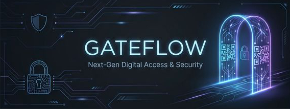

# <p align="center">GateFlow — The Invisible Sentinel</p>

<p align="center">
  
</p>

<p align="center">
  <b>The Enterprise Operating System for Physical Access Control & Marketing Intelligence.</b><br>
  <i>Stripe-level infrastructure for the 2026 MENA PropTech landscape.</i>
</p>

<p align="center">
  
  
  
  
  
</p>

<p align="center">
  
  
  
  
  
  
</p>

---

## 💎 The Vision

GateFlow is not just a QR scanner—it is **Stripe-level infrastructure for physical access**. By treating ogni physical arrival as a first-class digital conversion event, we provide a seamless, secure, and auditable data loop for gated communities, enterprise facilities, and high-volume events.

---

## 🗂️ Table of Contents

1.  [The 6-App Ecosystem](#-the-6-app-ecosystem)
2.  [Master Architecture](#-master-architecture)
3.  [Strategic Core Pillars](#-strategic-core-pillars)
4.  [Security & Compliance](#-security--compliance)
5.  [Analytics & Intelligence](#-analytics--intelligence)
6.  [Localization & i18n](#-localization--i18n)
7.  [The Ralph Loop Automation](#-the-ralph-loop-automation)
8.  [Performance & Governance](#-performance--governance)
9.  [Documentation & Support](#-documentation--support)

---

## 🏗️ The 6-App Ecosystem

GateFlow is a technical monorepo orchestrating six specialized applications, unified by a shared core of design tokens, cryptographic standards, and real-time data flows.

<details open>
<summary><b>View App Matrix</b></summary>

| Application                                   | Role           | Key Capability                                    | Deployment              |
| :-------------------------------------------- | :------------- | :------------------------------------------------ | :---------------------- |
| **[Client Dashboard](apps/client-dashboard)** | Property Hub   | Real-time monitoring (SSE), Marketing ROI & CRM.  | Vercel                  |
| **[Admin Dashboard](apps/admin-dashboard)**   | Platform Ops   | Multi-tenant isolation & Cloud platform health.   | Vercel                  |
| **[Resident Mobile](apps/resident-mobile)**   | User Interface | Native iOS/Android pass creation & WhatsApp sync. | App Store/Play          |
| **[Scanner App](apps/scanner-app)**           | Field Agent    | Offline-first HMAC validation & Haptic feedback.  | Enterprise Distribution |
| **[Resident Portal](apps/resident-portal)**   | Web Access     | Guest management & Pass self-service utility.     | Vercel                  |
| **[Marketing Site](apps/marketing)**          | Growth Node    | High-SEO conversion funnels & Tracking events.    | Vercel                  |

</details>
 
 ---
 
## 🚀 Quick Start & Local Development

Follow these steps to get a fresh clone of GateFlow running on your local machine.

### 1. Prerequisites

Ensure you have the following installed:

- **Node.js v20+**
- **pnpm v8+** (`npm i -g pnpm`)
- **PostgreSQL v16+** (Running locally or on a managed instance)

### 2. Automatic Setup (Recommended)

The fastest way to get started is by running our unified onboarding script:

```bash
git clone https://github.com/iDorgham/Gateflow.git
cd Gateflow
pnpm setup:dev
```

This script will:

1. Install all dependencies (`pnpm install`).
2. Guide you through creating your `.env.local` file.
3. Generate the **Prisma Client**.
4. Push the schema to your database (`prisma db push`).
5. Install Git hooks for security and linting.

### 3. Manual Setup (Step-by-Step)

If you prefer to configure the environment manually:

**A. Install Dependencies**

```bash
pnpm install
```

**B. Environment Variables**
Copy `.env.example` to `.env.local` and fill in your database and security secrets:

```bash
cp .env.example .env.local
```

**C. Database Initialization**

```bash
# Generate the Prisma Client
pnpm db:generate

# Push schema to your DB (use migrate dev if you want versioned migrations)
pnpm --filter @gate-access/db exec prisma db push
```

### 4. Running the Applications

You can start the entire ecosystem or specific apps using Turborepo filters:

| Dashboard / App      | Port | Command              |
| :------------------- | :--- | :------------------- |
| **All Web Apps**     | Var  | `pnpm dev`           |
| **Client Dashboard** | 3001 | `pnpm dev:client`    |
| **Admin Dashboard**  | 3002 | `pnpm dev:admin`     |
| **Marketing Site**   | 3000 | `pnpm dev:marketing` |
| **Resident Portal**  | 3004 | `pnpm dev:resident`  |
| **Scanner App**      | Exp  | `pnpm dev:scanner`   |
| **Resident Mobile**  | Exp  | `pnpm dev:mobile`    |

### 5. Mobile Development (Expo)

For the **Scanner App** and **Resident Mobile**:

1. Ensure you have the **Expo Go** app installed on your phone.
2. Start the dev server: `pnpm dev:scanner`.
3. Scan the QR code reflected in your terminal to open the app.

---

## 🏗️ Master Architecture

GateFlow follows a modern, enterprise-grade, scalable monorepo structure powered by **Turborepo** and **pnpm**, ensuring consistent versioning and
high-speed delivery paths.

```text
/GateFlow (Root)
├── /apps                          # Mission-Critical Applications
│   ├── admin-dashboard            # Internal Platform Operations (Next.js 15)
│   ├── client-dashboard           # B2B Property Manager Portal (Next.js 15)
│   ├── marketing                  # Public Landing & SEO Funnels (Next.js 15)
│   ├── resident-mobile            # Native iOS/Android Apps (Expo 54)
│   ├── resident-portal            # Web-based Resident Utility (Next.js 15)
│   └── scanner-app               # Field Verification (React Native, Offline-First)
├── /packages                      # Shared Core Infrastructure
│   ├── db                         # Prisma + Multi-tenant middleware + Seeding
│   ├── ui                         # Atlassian Design System (ADS) Component Library
│   ├── types                      # Universal TS Types & Zod Cross-App Schemas
│   ├── i18n                       # Localized AR/EN Dictionaries
│   ├── api-client                 # Shared Type-safe Fetch Utilities
│   └── config                    # Shared ESLint + Tailwind + TSConfig Presets
└── /scripts                       # The Ralph Loop Automation Backbone
```

---

## 🛡️ Strategic Core Pillars

### 1. Cryptographic Access (Zero-Trust)

Verification happens exclusively on the edge. Every QR code contains a cryptographic proof of origin, ensuring gate operations continue even with zero connectivity. All sensitive field data is encrypted at rest using **AES-256**.

### 2. Physical-to-Digital Marketing ROI

The first platform to bridge the gap between digital spend and physical arrivals.

- **UTM Lifecycle Persistence**: Track visitors from ad-click (Meta/Google/SMS) to the physical scanner.
- **Conversion APIs**: Automated server-side firing to Meta Pixel and GA4 upon gate entry.

### 3. Atlassian Design System (ADS) Foundation

A global design token architecture ensures that brand identity, typography, and spacing are 100% consistent across web and native mobile interfaces.

---

## 🔒 Security & Compliance

GateFlow is built with a "Security-by-Design" philosophy.

- **HMAC-SHA256 Signing**: Every QR pass is cryptographically signed and immutable.
- **Tenant Isolation**: Prisma middleware enforces `organizationId` scoping on every database query.
- **AES-256 Encryption**: Native encryption for sensitive offline scan queues.
- **RBAC Enforcement**: Granular Role-Based Access Control across all dashboards.

---

## 🧠 Analytics & Intelligence

Transforming physical arrivals into actionable data intelligence.

- **Real-time Monitoring**: Server-Sent Events (SSE) push scan logs directly to administrative panels.
- **GateAI Co-pilot**: An agentic intelligence layer to manage infrastructure via natural language.
- **Advanced Charts**: High-density Recharts data visualization integrated into the "Resident CRM".

---

## 🌐 Localization & i18n

Engineered specifically for the Middle Eastern market.

- **Arabic-First Design**: Full RTL (Right-to-Left) layout support for Arabic speakers.
- **Zero-Friction Switching**: Clean, localized typography (Cairo font) for bi-directional support.
- **Dynamic LTRS/RTL**: UI components automatically adjust dimensions based on the active locale.

---

## 🚀 The Ralph Loop Automation

Every routine engineering task is managed by **Ralph**, the GateFlow autonomous engineering backbone.

- **19+ Automation Scripts**: From hierarchical seeding to automated traffic emulation.
- **5 Husky Git Hooks**: Enforcing committed secrets scanning, linting, and AI-tool sync.
- **Phase Runner**: Automated plan-to-dev loop with 100% compliance auditing.
- **Type-Safe Sync**: Cross-package synchronization for universal types and schemas.

---

## 📊 Performance & Governance

We maintain a zero-regression performance policy.

<p align="left">
  
  
</p>

- **100/100 Lighthouse**: Guaranteed vitals across both Desktop and Mobile.
- **Syncpack Enforcement**: Ensuring absolute dependency consistency across the monorepo packages.
- **Automated CI/CD**: High-precision deployment via GitHub Actions to Vercel and Native App Stores.

---

## 📚 Documentation & Support

Detailed technical resources for the GateFlow platform.

- **[Master PRD v11.0](docs/reference/product/PRD.md)** — Comprehensive technical specifications.
- **[Marketing Suite](docs/reference/product/MARKETING_SUITE.md)** — Physical attribution guide.
- **[Automation Guide](docs/guides/AUTOMATION_GUIDE.md)** — Reference for the Ralph Loop stack.
- **[Strategic Pipeline](CHANGELOG.md)** — Release notes and roadmap history.

---

<p align="center">
  
  
  
</p>

<div align="center">
  <sub>Managed by the <b>Ralph Loop</b> Autonomous Engineering Infrastructure.</sub><br>
  <sub>&copy; 2026 GateFlow. All rights reserved.</sub>
</div>
