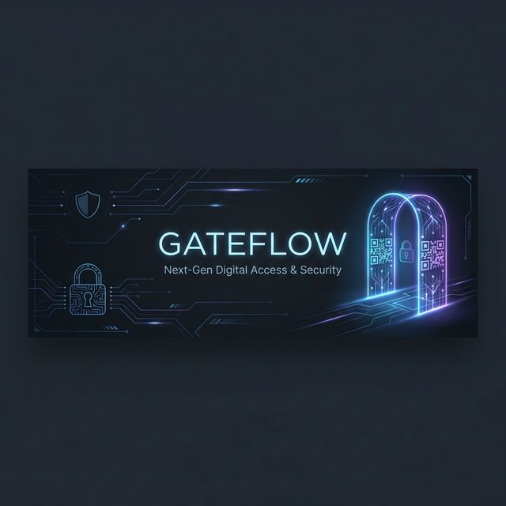

<p align="center">
  
</p>

<h1 align="center">GateFlow Admin Dashboard</h1>

<p align="center">
  <strong>Super Admin Platform Management</strong><br>
  <em>Platform-wide organization management, analytics, and system health monitoring</em>
</p>

<p align="center">
  
  
  
</p>

---

## 📋 Overview

The **GateFlow Admin Dashboard** is the super-admin panel for platform operators to manage the entire GateFlow ecosystem. It provides visibility into all organizations, users, system health, and platform analytics.

### Purpose

- 🏢 **Organization Management** — View, suspend, and manage all tenant organizations
- 👥 **User Management** — Cross-organization user administration
- 📊 **Platform Analytics** — System-wide metrics and reporting
- 💰 **Billing Overview** — Revenue and subscription tracking
- 🔧 **System Health** — Server and database monitoring
- 🔐 **Authorization Keys** — Platform-level API keys
- 🤖 **AI Assistant** — Gemini-powered admin tools

---

## ✨ Features

### Platform Features

| Feature | Description | Status |
|---------|-------------|--------|
| **Organization Management** | List, view, suspend organizations | ✅ Complete |
| **User Management** | Cross-org user administration | ✅ Complete |
| **System Analytics** | Platform-wide metrics | ✅ Complete |
| **AI Assistant Panel** | Gemini-powered tools | ✅ Complete |
| **Finance Overview** | MRR estimation, billing | ✅ Complete |
| **Server Health** | Live DB/Redis monitoring | ✅ Complete |
| **Platform Settings** | Environment config | ✅ Complete |
| **Authorization Keys** | ADMIN/SERVICE keys | ✅ Complete |

### AI Admin Tools

| Tool | Description |
|------|-------------|
| **Platform Metrics** | Real-time tracking of orgs, users, and global scan activity |
| **Entity Analyzer** | Deep-dive analysis of specific organizations, users, or projects |
| **Seeding Matrix** | Natural language execution of complex data generation blueprints |
| **Security Audit** | AI-driven review of access logs and system anomalies |
| **System Health** | Gemini-powered interpretation of live DB and Redis health |

---

## 💻 Tech Stack

| Category | Technology |
|----------|------------|
| **Framework** | Next.js 14 (App Router) |
| **Language** | TypeScript |
| **Styling** | Tailwind CSS + shadcn/ui |
| **Database** | PostgreSQL via Prisma |
| **Auth** | JWT (jose) + Argon2id |
| **Charts** | Recharts |
| **AI** | Google Gemini SDK |
| **i18n** | i18next |

### Key Dependencies

```json
{
  "next": "^14.2.35",
  "@gate-access/db": "^0.1.0",
  "@gate-access/ui": "workspace:^",
  "@gate-access/i18n": "workspace:^",
  "@ai-sdk/google": "^1.2.0",
  "ai": "4",
  "recharts": "^2.15.4"
}
```

---

## 🚀 Getting Started

### Prerequisites

- Node.js 20+
- pnpm 8+
- PostgreSQL 15+

### Installation

```bash
# From monorepo root
pnpm install

# Setup database (if needed)
cd packages/db
npx prisma generate

# Start development
pnpm turbo dev --filter=admin-dashboard
```

### Development Server

```bash
# Navigate to app directory
cd apps/admin-dashboard

# Run development server
pnpm dev

# Run tests
pnpm test

# Type-check
pnpm typecheck
```

### Default Port

```
http://localhost:3002
```

---

## 📁 Project Structure

```
apps/admin-dashboard/
├── app/
│   ├── api/                   # API routes
│   │   ├── admin/            # Admin endpoints
│   │   └── ...               # Shared routes
│   ├── (dashboard)/          # Protected routes
│   │   ├── organizations/   # Org management
│   │   ├── users/            # User management
│   │   ├── analytics/        # Platform analytics
│   │   ├── billing/          # Finance overview
│   │   ├── health/           # Server health
│   │   ├── settings/         # Platform settings
│   │   ├── auth-keys/        # Authorization keys
│   │   └── ai/               # AI assistant
│   └── layout.tsx            # Dashboard layout
├── components/               # React components
│   ├── dashboard/            # Dashboard components
│   ├── analytics/            # Chart components
│   └── ...
└── lib/                      # Utilities
```

---

## 🔐 Access Control

### Required Role

```
ADMIN — Platform-level administrator
```

### Authorization Keys

| Type | Access |
|------|--------|
| `ADMIN` | Full platform access |
| `SERVICE` | Cross-org service operations |

---

## 📊 Platform Metrics

### Available Analytics

- 📈 **Total Organizations** — Active tenant count
- 👥 **Total Users** — Platform-wide users
- 🔲 **Total QR Codes** — Generated passes
- 📊 **Scan Volume** — Platform-wide scans
- 💰 **Revenue** — MRR estimation
- 🏥 **System Health** — DB/Redis status

---

## 🔗 Related Apps

| App | Description | Port |
|-----|-------------|------|
| [Client Dashboard](../client-dashboard) | Tenant portal | 3001 |
| [Marketing](../marketing) | Public website | 3000 |
| [Scanner App](../scanner-app) | Gate scanning | 8081 |

---

## 📄 License

MIT License — see [../../LICENSE](../../LICENSE) for details.

---

<p align="center">
  <strong>Part of the GateFlow Ecosystem</strong><br>
  <a href="https://gateflow.io">Website</a> • <a href="https://github.com/iDorgham/Gateflow">GitHub</a>
</p>
