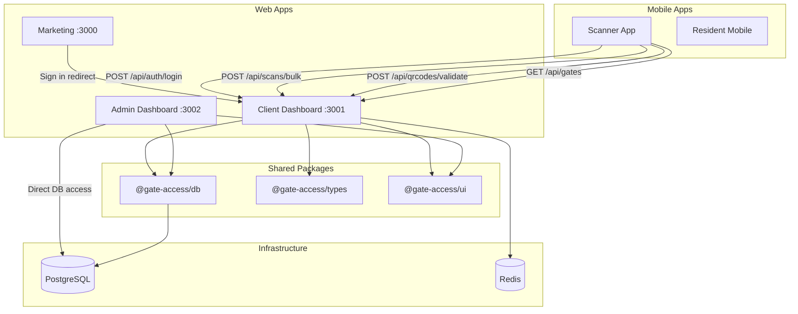

# GateFlow — App Design Documents

**Last Updated:** February 23, 2026

This document provides a comprehensive design reference for each application in the GateFlow ecosystem, including architecture, routes, components, and inter-app communication.

---

## 1. Client Dashboard (`apps/client-dashboard`)

### Overview
The primary SaaS management interface. Property managers, event organizers, and team admins use this to manage gates, generate QR codes, view analytics, and configure integrations.

- **Framework:** Next.js 14 (App Router)
- **Port:** 3001 (`-H 0.0.0.0` for mobile access)
- **Auth:** JWT (access + refresh tokens) with double-submit CSRF cookies

### Page Routes (15 pages)

| Route | Type | Description |
| ----- | ---- | ----------- |
| `/` | Server | Root redirect |
| `/login` | Server + Client | Auth form with `loginAction` Server Action |
| `/logout` | Server | Token cleanup + redirect |
| `/dashboard` | Server | Main stats: today's scans, QRs, gates, 7-day trends |
| `/dashboard/onboarding` | Server | 3-step org creation wizard |
| `/dashboard/qrcodes` | Server | QR list table with filters |
| `/dashboard/qrcodes/create` | Server + Client | Single QR creation form |
| `/dashboard/qrcodes/bulk` | Server + Client | Bulk CSV QR import |
| `/dashboard/gates` | Server + Client | Gate CRUD management |
| `/dashboard/team` | Server + Client | Team member invite/role/remove |
| `/dashboard/analytics` | Server | Charts: 7-day trend, status breakdown, top gates |
| `/dashboard/scans` | Server | Scan log table with export |
| `/dashboard/profile` | Server + Client | User settings (name, email, password) |
| `/dashboard/projects` | Server + Client | Project management (multi-project) |
| `/dashboard/workspace/settings` | Server + Client | Organization settings |
| `/dashboard/workspace/api-keys` | Server + Client | API key CRUD with copy-to-clipboard |
| `/dashboard/workspace/billing` | Server + Client | Plan display, pricing cards, invoices |
| `/dashboard/workspace/webhooks` | Server + Client | Webhook endpoint management |
| `/qr/[code]` | Server | Public QR code viewer |

### API Routes (19 endpoints)

| Endpoint | Method | Auth | Purpose |
| -------- | ------ | ---- | ------- |
| `/api/auth/login` | POST | Public | Email/password authentication |
| `/api/auth/logout` | POST | JWT | Revoke refresh token |
| `/api/auth/refresh` | POST | Refresh Token | Token rotation |
| `/api/gates` | GET | JWT | List gates for organization |
| `/api/onboarding/complete` | POST | JWT | Create org + gate + re-issue token |
| `/api/api-keys` | GET, POST | JWT | List/create API keys |
| `/api/api-keys/[id]` | DELETE | JWT | Revoke API key |
| `/api/webhooks` | GET, POST | JWT | List/create webhooks |
| `/api/webhooks/[id]` | PUT, DELETE | JWT | Update/delete webhook |
| `/api/webhooks/[id]/test` | POST | JWT | Send test delivery |
| `/api/qr/bulk-create` | POST | JWT | Bulk CSV QR generation |
| `/api/qr/send-email` | POST | JWT | Email QR to recipient |
| `/api/qrcodes/validate` | POST | Bearer | Server-side QR validation (scanner) |
| `/api/scans/bulk` | POST | Bearer | Offline scan sync (scanner) |
| `/api/scans/export` | GET | JWT | CSV export of scan logs |
| `/api/projects` | GET, POST | JWT | List/create projects |
| `/api/projects/[id]` | PUT, DELETE | JWT | Update/delete project |
| `/api/project/switch` | POST | JWT | Switch active project |
| `/api/override/log` | POST | JWT | Log supervisor override |

### Library Modules (14 files)

| Module | Purpose |
| ------ | ------- |
| `auth.ts` | JWT sign/verify helpers (`jose`) |
| `auth-cookies.ts` | Cookie-based session management |
| `csrf.ts` | CSRF token generation/validation |
| `use-csrf.ts` | Client-side CSRF React hook |
| `dashboard-auth.ts` | Dashboard session utilities |
| `require-auth.ts` | Auth guard for Server Components |
| `api-key-auth.ts` | API key authentication middleware |
| `rate-limit.ts` | Upstash Redis rate limiter |
| `encryption.ts` | AES-256 field encryption for secrets |
| `webhook-delivery.ts` | Webhook dispatch + retry logic |
| `project-cookie.ts` | Multi-project cookie management |
| `types.ts` | Dashboard-specific TypeScript types |
| `utils.ts` | General utilities (cn, formatDate) |
| `auth.test.ts` | Auth unit tests |

### Middleware
- **CSRF Protection**: Double-submit cookie validation for all non-GET routes
- **Exemptions**: Server Actions (`next-action` header), public auth routes, scanner endpoints

---

## 2. Admin Dashboard (`apps/admin-dashboard`)

### Overview
Platform-level super-admin interface for managing all organizations, users, and system analytics across the entire GateFlow platform.

- **Framework:** Next.js 14 (App Router)
- **Port:** 3002
- **Status:** ~15% complete

### Page Routes (4 pages)

| Route | Description |
| ----- | ----------- |
| `/` | Admin home / redirect |
| `/login` | Admin authentication |
| `/organizations` | List/manage all platform organizations |
| `/users` | List/manage all platform users |

### API Routes

| Endpoint | Method | Purpose |
| -------- | ------ | ------- |
| `/api/admin/organizations` | GET | List all orgs (paginated) |
| `/api/admin/users` | GET | List all users (paginated) |

### Architecture Notes
- Uses same `@gate-access/db` and `@gate-access/ui` packages
- Planned features: billing management, system analytics, compliance reporting

---

## 3. Scanner App (`apps/scanner-app`)

### Overview
The mobile QR scanner used by gate security personnel. Supports offline scanning with encrypted local queue and automatic background sync.

- **Framework:** Expo / React Native (SDK 54)
- **Metro Port:** 8081
- **API Target:** `http://192.168.1.2:3001/api` (configurable via `EXPO_PUBLIC_API_URL`)

### Components (3 files)

| Component | Purpose |
| --------- | ------- |
| `GateSelector.tsx` | Bottom-sheet modal for selecting active gate |
| *Camera scanner* | Built into `App.tsx` — expo-camera integration |
| *Login screen* | Built into `App.tsx` — email/password form |

### Library Modules (9 files)

| Module | Purpose |
| ------ | ------- |
| `auth-client.ts` | Login/logout, token storage (SecureStore), refresh rotation |
| `offline-queue.ts` | Encrypted scan queue (AsyncStorage + AES-256 + PBKDF2) |
| `scanner.ts` | Server validation, offline fallback, haptic feedback |
| `auth-client.test.ts` | Auth unit tests |
| `qr-verify.ts` | Local QR signature verification |
| *(+ additional helpers)* | Crypto, network, device utilities |

### Authentication Flow
```
Login → POST /api/auth/login → Store JWT + CSRF in SecureStore
       → Token auto-refresh via isTokenExpired() check
       → Logout revokes refresh token server-side
```

### Offline Architecture
```
Scan QR → Verify locally (HMAC) → Encrypt scan data (AES-256)
       → Store in AsyncStorage queue → Check network
       → Online: POST /api/scans/bulk → Mark synced
       → Offline: Queue for later sync (max 10 retries)
```

### Test Suite
- **68 unit tests** covering auth, offline queue, encryption, sync
- Custom Jest environment for Node.js v25+ compatibility

---

## 4. Marketing Website (`apps/marketing`)

### Overview
Public-facing marketing site for GateFlow. Includes landing page, pricing hints, and CTA buttons that redirect to the client dashboard for sign-up/login.

- **Framework:** Next.js 14 (App Router)
- **Port:** 3000
- **Status:** ~30% complete

### Page Routes

| Route | Description |
| ----- | ----------- |
| `/` | Landing page with hero, features, pricing, CTA |

### Architecture
- Standalone Next.js app with Tailwind CSS
- "Sign in" button redirects to `http://localhost:3001/login`
- No API routes — pure static/SSR marketing content

---

## 5. Resident Portal (`apps/resident-portal`) — Planned

### Overview
Self-service web portal for compound residents to create visitor QR codes, manage access rules, and track visitor history.

- **Framework:** Next.js 14 (App Router)
- **Auth:** JWT with `RESIDENT` role
- **Status:** Not yet implemented

### Planned Features
- Unit linking and quota management
- Visitor QR creation (one-time, date range, recurring, permanent)
- Open QR for family/permanent access
- Visitor history and arrival notifications

---

## 6. Resident Mobile (`apps/resident-mobile`) — Planned

### Overview
Native mobile companion to the resident portal for simplified QR creation and push notifications.

- **Framework:** Expo / React Native
- **Status:** Not yet implemented

---

## Inter-App Communication



### Key Integration Points

| From | To | Mechanism | Purpose |
| ---- | -- | --------- | ------- |
| Marketing → Dashboard | HTTP redirect | User sign-in |
| Scanner → Dashboard | REST API (Bearer) | Login, QR validation, bulk sync |
| Dashboard → PostgreSQL | Prisma ORM | All data operations |
| Dashboard → Redis | Upstash client | Rate limiting |
| Dashboard → Webhooks | HTTP POST | Event notifications to subscribers |

---

## Security Architecture

### Authentication Flow
```
1. User submits email + password
2. Server verifies with Argon2id hash
3. Issues JWT access token (15 min) + refresh token (7 days)
4. Sets CSRF double-submit cookie
5. Client stores tokens in httpOnly cookies (web) or SecureStore (mobile)
6. Token rotation on every refresh
```

### Multi-Tenancy
- Every query filtered by `organizationId`
- Row-level isolation enforced at ORM layer
- Middleware validates org membership from JWT claims

### QR Code Security
- **Signing:** HMAC-SHA256 (`QR_SIGNING_SECRET`)
- **Dual verification:** Client-side (expiry + signature) + Server-side (full validation)
- **Offline:** AES-256 encrypted queue with PBKDF2-derived key
