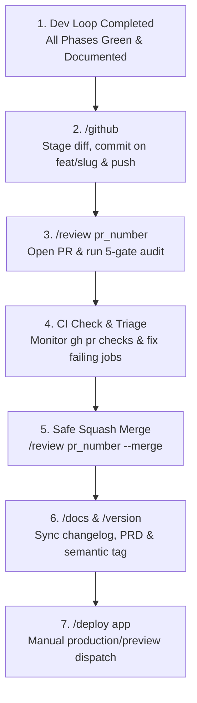

# GateFlow — Phased Development Workflow (v3.0)

**Purpose:** Comprehensive framework for phased development, featuring the **Ralph Loop** for self-correction, **Recursive Autopilot** (/dev ralph) for hands-off execution, and **Full-Cycle Automation** (Auto-Sync, PR Orchestration, Backlog Sync).

---

## 1. The Ralph Loop (Self-Correction)

Every phase execution follows the Ralph Loop to ensure zero-violation code:

1. **IMPLEMENT**: Write code following the phase prompt.
2. **ENFORCE**: Run `node scripts/enforce-ads-design.js` and `node scripts/enforce-security-invariants.js`.
3. **SELF-CORRECT**: If violations are found, refactor immediately. Repeat until GREEN.
4. **VERIFY**: Run `pnpm preflight` (lint, typecheck, test).

---

## 2. Recursive Autopilot (/dev ralph)

The `/dev ralph` command triggers a continuous execution loop:

### Execution Logic:

- **Phase 1..N**: Perform the **Ralph Loop** for the current phase.
- **Auto-Versioning**: On success, run `node scripts/ralph-git.js commit <slug> <N>` and `node scripts/ralph-git.js merge <slug> <N>`.
- **Recursion Check**:
  - Look for `PROMPT_<slug>_phase_<N+1>.md`.
  - **If found**: Log "Autopilot: Starting Phase N+1" and immediately proceed to implement it.
  - **If not found**: Check `PLAN_<slug>.md` for missing prompts. If all phases are done, tag the release and finalize.

### Hard Gates for Recursion:

- No recursion if `pnpm preflight` fails.
- No recursion if security enforcers are RED.
- No recursion if `organizationId` or `deletedAt` invariants are violated.

## 3. DevOps & PR Delivery Lifecycle (When Plan Finishes)

When all phases in a plan are completed (`Phase N of N` finished in `/dev` or `/ship`):

### Steps:

1. **GitHub Delivery (`/github` or `/github ready`)**: Stage changes, run `pnpm pr:ready`, commit to `feat/<slug>`, and push branch to remote.
2. **Pull Request & 5-Gate Review (`/review <pr_number>`)**: Open PR and audit multi-tenancy/PII, types/schema, ADS/RTL, CLS/perf, and CI status.
3. **CI Triage & Verification**: Inspect `gh pr checks <pr_number>` and resolve any failing checks until 100% green.
4. **Safe Merge (`/review <pr_number> --merge`)**: Coordinate squash merge into master and branch cleanup once authorized.
5. **Documentation & Release (`/docs` -> `/version`)**: Sync changelog, PRD v13.0, and create version tag.
6. **Deployment (`/deploy <app>`)**: Trigger production release.

---

## 4. Usage Reference

| Command      | Behavior                                                                       |
| ------------ | ------------------------------------------------------------------------------ |
| `/dev`       | Implement next incomplete phase; stop for feedback.                            |
| `/dev ralph` | Implement next incomplete phase; **auto-start** next phase if prompts exist.   |
| `/ship`      | Execute entire plan end-to-end (similar to ralph, but for pre-existing plans). |
| `/github`    | Feature branch staging, commit, push, and PR checklist.                        |
| `/review`    | PR inspection, 5-gate security audit, and safe-merge execution.                |
| `/deploy`    | Pre-flight validated production deploy dispatch.                               |

---

## 5. Exit Conditions (EC)

- **EC-Phase (Done)**: GREEN enforcers + GREEN tests + Phase log written.
- **EC-Plan (Final)**: All phases satisfied EC-Phase + PR 5-gate reviewed + CI 100% green + Merged to master + Changelog updated.
