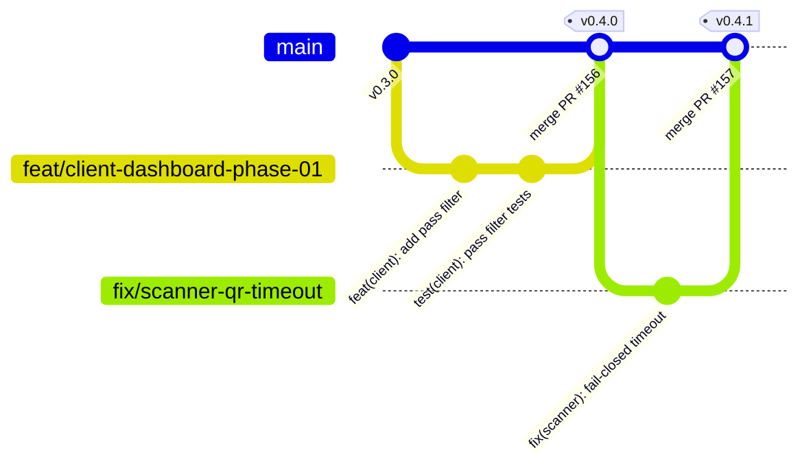
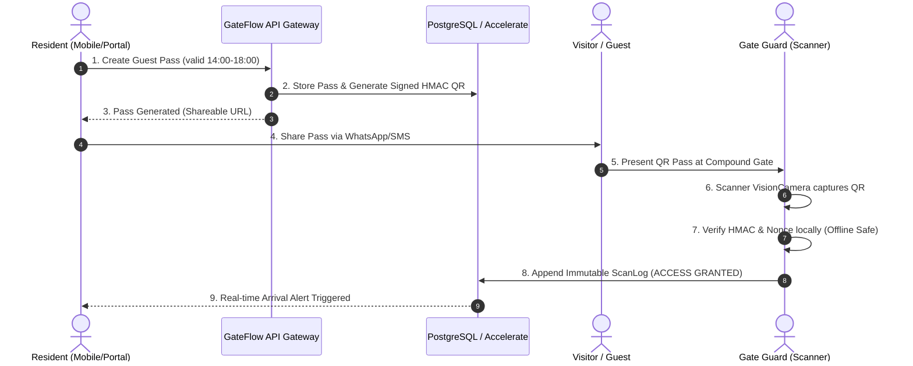

# NOTEBOOKLM SOURCE 10: Master Review, Tasks, Gitflow, Security, Performance & System Critique

---

## 1. Executive Review & System Architecture Overview

**GateFlow** is an enterprise-grade multi-tenant physical-access, resident operations, and operational intelligence platform specifically engineered for gated communities, residential compounds, and real estate developments across the MENA region.

### 1.1 Platform Topology & Monorepo Organization

GateFlow operates as a **Turborepo monorepo** managed with `pnpm` (version `8.15.0`, GateFlow release version `0.4.1`, Node.js >= 20.0.0). The codebase isolates concerns across 7 distinct application surfaces and 12 shared foundational packages:

```text
GateFlow Monorepo (gate-access)
├── apps/
│   ├── client-dashboard/       # Property manager & security supervisor console (Next.js 16)
│   ├── admin-dashboard/        # Platform super-admin & tenant control plane (Next.js 16)
│   ├── scanner-app/            # High-speed gate guard scanner (React Native / Expo SDK 57)
│   ├── resident-mobile/        # Native resident guest pass & community app (React Native / Expo SDK 57)
│   ├── resident-portal/        # Web resident guest pass & service request portal (Next.js 16)
│   ├── marketing/              # Public marketing site, attribution engine, blog (Next.js 16)
│   └── design-system/          # Interactive component catalog & design tokens explorer
├── packages/
│   ├── db/                     # Prisma 6.19.3 ORM, PostgreSQL schema, migrations, connection pools
│   ├── ui/                     # Atlassian/Radix design system primitives & token wrappers
│   ├── types/                  # Shared TypeScript contracts, API interfaces, DTOs, reason codes
│   ├── api-client/             # Typed HTTP client layer with automatic auth & tenant headers
│   ├── i18n/                   # Arabic (RTL) & English (LTR) dictionaries and direction providers
│   ├── utils/                  # Cryptography (HMAC, AES-GCM), string formatters, date utilities
│   ├── stripe/                 # Subscription billing, webhook handlers, customer portals
│   ├── config/                 # Monorepo ESLint, Prettier, and TypeScript base configurations
│   ├── theme/                  # Theme tokens, dark/light palette definitions, CSS variables
│   ├── tokens/                 # Design token constants (colors, spacing, elevation, radii)
│   ├── components/             # Composite UI modules (data tables, filter bars, modals)
│   └── ai/                     # GateAI assistant logic, streaming parsers, tool calling definitions
└── docs/                       # PRDs, plans, audits, guides, and NotebookLM knowledge sources
```

---

## 2. Comprehensive Gitflow, Branching & AI-Orchestrated Development Lifecycle

GateFlow utilizes an advanced **Gitflow & Phased Autopilot Lifecycle** combined with automated AI-developer synchronization and multi-CLI orchestration.

### 2.1 Branching Strategy & Gitflow Convention

All repository changes follow strict branch naming policies enforced via Husky git hooks (`.husky/pre-push`):



1. **Allowed Branch Prefixes** (enforced by `.husky/pre-push` regex `^(feat|fix|chore|hotfix|refactor|docs|test|perf|ci|security)(/.+)?$`):
   - `feat/<initiative>-phase-<N>`: Feature work tied to an active plan phase.
   - `fix/<issue-description>`: Bug fixes and security patch remediation.
   - `chore/<maintenance-task>`: Dependency bumps, workspace hygiene, and refactoring.
   - `hotfix/<critical-patch>`: Immediate production emergency patches.
   - `refactor/<scope>`: Refactoring and code restructuring.
   - `docs/<topic>`: Documentation, guides, and changelog updates.
   - `test/<scope>`: Test infrastructure and test additions.
   - `perf/<scope>`: Dedicated performance, query optimization, or bundle tuning.
   - `ci/<scope>`: GitHub Actions and quality gate improvements.
   - `security/<scope>`: Security hardening and vulnerability fixes.
     _Prohibited prefixes:_ `codex/*`, `cursor/*` (enforced fail-closed in pre-push hook).

2. **Commit Standard (Conventional Commits):**
   - Strictly enforced via `@commitlint/config-conventional` and `commitlint.config.js`.
   - Pattern: `<type>(<scope>): <subject>` (e.g., `feat(scanner): add offline HMAC rotation`, `fix(db): ensure organizationId filter on scan queries`).
   - Allowed types: `feat`, `fix`, `docs`, `style`, `refactor`, `perf`, `test`, `build`, `ci`, `chore`, `revert`.

3. **Preflight Quality Gate (`pnpm preflight`):**
   Before any push or merge, the full deterministic verification suite must pass:

   ```bash
   pnpm docs:changelog:check && pnpm check:ads && pnpm check:bootstrap-routes && pnpm turbo lint && pnpm turbo typecheck && pnpm turbo test
   ```

### 2.2 Phased Development Framework (`docs/plan/`)

Every non-trivial initiative follows a strict lifecycle across four state directories:

```text
docs/plan/
├── Draft/<slug>/       # Raw initiatives, brainstorming, exploratory architecture (DRAFT_<slug>.md)
├── Ready/<slug>/       # Approved, fully phased specifications with per-phase prompts (PLAN_<slug>.md)
├── Active/<slug>/      # Currently in implementation; one phase active at a time
└── Complete/<slug>/    # Fully verified, certified, tested, and shipped initiatives
```

- **Execution Commands:**
  - `/dev [<slug>] [<phase>]`: Executes exactly one phase end-to-end (code, unit tests, lint, commit).
  - `/ship [<slug>]`: Sequentially executes all phases of an initiative until complete.
  - `/certify`: Verifies pilot readiness against immutable runtime evidence (zero manual checkboxes).

### 2.3 Multi-CLI & AI Agent Coordination

The repository maintains synchronized instruction sets across multiple AI engineering tools (`pnpm sync` copies canonical `.agents/` rules to `.cursor/`, `.claude/`, `.gemini/`, `.kiro/`, `.kilocode/`, and `.opencode/`):

- **CLI Limit Tracking & The 80% Rule:** Usage across high-token CLIs is tracked in `docs/development/learning/CLI_LIMITS_TRACKING.md`. When usage crosses 80%, agents fail-closed and request explicit user confirmation.
- **Ralph Perspectives:** Automated scripts (`ralph-prioritize.js`, `ralph-skill-discover.js`, `ralph-git.js`) continuously audit task backlog priority, discover architectural patterns, and automate atomic git phase branching.

---

## 3. Tasks, Backlog & Feature Inventory

### 3.1 Unfinished & In-Progress Tasks by Application

#### 1. Client Dashboard (`apps/client-dashboard`)

- [ ] **CPV Analytics:** Implement interactive cost-per-visit analytics charts and multi-gate financial reporting.
- [ ] **Bulk Resident Import:** Add XLSX/CSV parser with preview, schema validation, and async background creation.
- [ ] **Multi-Project Interactive Map:** Render compound layout maps with live gate status indicators.
- [ ] **Public Rate Limiting:** Apply Redis/token-bucket rate limits on public guest invite redemption links.
- [ ] **ScanLog Query Optimization:** Implement materialization or time-partitioned aggregation for high-volume logs.
- [ ] **CRM Webhooks:** Add outbound webhooks for Salesforce/Hubspot integration on guest check-ins.

#### 2. Admin Dashboard (`apps/admin-dashboard`)

- [x] **Dark Mode & ADS Alignment:** Complete visual pass aligning typography, radius, and elevation with Client Dashboard.
- [x] **Admin AI Assistant:** Implement hybrid conversational UI with real-time tool calling visualization.
- [ ] **Quota Visualization:** Build tenant usage metering charts (active passes, scan events, storage).
- [ ] **Global Entity Search:** Deploy cross-organization search index for platform super-administrators.
- [ ] **Organization Backups:** Automated point-in-time organization configuration snapshots and restore wizard.
- [ ] **CMS Shell (Phase 2):** Admin-governed content management for marketing pages and knowledge articles.

#### 3. Scanner App (`apps/scanner-app`)

- [x] **Device Unlock Gate:** Fail-closed PIN and biometric protection on scanner launch.
- [x] **Shift Accountability:** Guard sign-in, shift start, gate assignment, and shift handover logging.
- [ ] **Haptic Feedback:** Distinct tactile vibration signatures for `GRANTED`, `DENIED`, `WATCHLIST_ALERT`.
- [ ] **Low-Light Torch Mode:** Camera view overlay toggle for night-time compound gate scanning.
- [ ] **Offline Sync Indicator:** Real-time visual counter showing pending unsynced scan records.
- [ ] **Background Sync Worker:** Seamless background sync of queued scans via Expo TaskManager.

#### 4. Resident Mobile (`apps/resident-mobile`)

- [ ] **Quick Pass Widget:** iOS Lock Screen & Android home screen quick guest pass creation widget.
- [ ] **Push Notification Center:** In-app notification history for guest arrivals and security notices.
- [ ] **WhatsApp Template Customizer:** Rich preview and localized copy generator for WhatsApp pass invites.
- [ ] **MENA WhatsApp API Integration:** Direct WhatsApp Business Cloud API integration for pass delivery.
- [ ] **Biometric Persistence:** SecureStore biometric session re-authentication across cold restarts.

#### 5. Resident Portal (`apps/resident-portal`)

- [ ] **Desktop Multi-Column Layout:** Enhanced wide-screen dashboard layout for tablet and desktop browsers.
- [ ] **Visitor Timeline Filter:** Advanced search and filter panel for past visitor arrival histories.
- [ ] **Pass Creation Latency Optimization:** Client-side optimistic QR preview prior to backend roundtrip.
- [ ] **Session Hijacking Guard:** User-agent and IP binding checks on resident web sessions.

#### 6. Marketing Website (`apps/marketing`)

- [ ] **Interactive Enterprise Pricing Calculator:** Dynamic tier calculator based on units and gates.
- [ ] **"Resilience" Campaign Pages:** High-conversion landing pages for enterprise real estate developers.
- [ ] **CRM Ingestion Pipeline:** Automated lead qualification and scoring into internal CRM tables.
- [ ] **Server-Side UTM Attribution:** Cryptographic attribution tracking from ad click to signed enterprise contract.

### 3.2 Master Feature Matrix

| Functional Module            | Shipped Features                                                                                          | Architectural Mechanism                                                      |
| :--------------------------- | :-------------------------------------------------------------------------------------------------------- | :--------------------------------------------------------------------------- |
| **Identity & Access**        | JWT Auth, Argon2id hashing, 15m access / 30d refresh tokens, SSO cookie sharing (`.gateflow.site`), RBAC. | Custom Next.js middleware + `jose` JWT + `httpOnly` secure cookies.          |
| **Physical Pass Issuance**   | Single pass, recurring schedule pass, bulk CSV generation, supervisor overrides.                          | HMAC-SHA256 signed payloads with timestamp boundaries and nonce tracking.    |
| **Gate Operations**          | Fast OCR, offline QR verification, shift start/handover, incident creation, watchlist alerts.             | Expo VisionCamera + local HMAC validation engine + SQLite sync queue.        |
| **Tenant & Data Governance** | Multi-tenant isolation, project partitioning, soft-delete semantics, automated GDPR data retention.       | AsyncLocalStorage tenant context + Prisma query extensions + cron retention. |
| **Operational Intelligence** | Live entry charts, gate throughput heatmaps, physical-to-digital marketing attribution, CSV exports.      | Server-Sent Events (SSE) + Recharts + PostgreSQL window aggregations.        |
| **Design & UI System**       | 50+ accessible components, dark/light theme tokens, RTL Arabic layout support, responsive grids.          | `@gate-access/ui` + Tailwind CSS v4 + Radix UI + CSS Variable Tokens.        |

---

## 4. Security & Compliance Architecture

GateFlow enforces a **Zero-Trust Physical-to-Digital Security Architecture**. Security guarantees are implemented at every architectural layer:

```text
[ Incoming Request / Scan ]
           │
           ▼
┌────────────────────────────────────────────────────────┐
│ 1. Edge / Middleware: CSRF & Rate-Limit Inspection     │
└──────────────────────────┬─────────────────────────────┘
                           │
                           ▼
┌────────────────────────────────────────────────────────┐
│ 2. Auth Layer: JWT (15m) + Argon2id + Cookie Domain    │
└──────────────────────────┬─────────────────────────────┘
                           │
                           ▼
┌────────────────────────────────────────────────────────┐
│ 3. Tenant Boundary: Request-Local AsyncLocalStorage    │
│    (Enforces organizationId on 100% of Prisma queries) │
└──────────────────────────┬─────────────────────────────┘
                           │
                           ▼
┌────────────────────────────────────────────────────────┐
│ 4. Data Layer: Soft-Deletes + Append-Only ScanLogs     │
└────────────────────────────────────────────────────────┘
```

### 4.1 Core Security Invariants

1. **Request-Local Fail-Closed Tenant Isolation:**
   - Every tenant-scoped API route must execute within an `AsyncLocalStorage` context populated during session verification.
   - Direct database calls without `organizationId` are strictly forbidden. If `organizationId` is missing from the context, queries abort and throw a `TenantIsolationViolationError`.

2. **Cryptographic QR Credentials & Offline Verification:**
   - Physical passes contain an encrypted or signed token payload including `qrId` (the QRCode database record ID):
     $$\text{Payload} = \text{Base64Url}(\text{qrId} \parallel \text{organizationId} \parallel \text{type} \parallel \text{maxUses} \parallel \text{expiresAt} \parallel \text{issuedAt} \parallel \text{nonce})$$
     $$\text{Signature} = \text{HMAC-SHA256}(\text{Payload}, \text{SecretKey})$$
   - The `qrId` is part of the signed payload and must match the database record ID; short URLs are provided for copy/share purposes only and do not replace the signed QR verification.
   - Mobile scanners carry securely cached cryptographic keys in hardware keystores (`Expo SecureStore` / iOS Keychain / Android Keystore) allowing sub-50ms offline verification without server communication.

3. **Append-Only Scan Auditing:**
   - The `ScanLog` table is strictly append-only. No `UPDATE` or `DELETE` permissions exist on scan logs.
   - Every scan captures: `passId`, `gateId`, `operatorId`, `decision` (`GRANTED`, `DENIED`, `EXPIRED`, `UNAUTHORIZED_GATE`), `reasonCode`, `nonce`, `latitude`, `longitude`, and optional `photoUrl`.

4. **Session Hygiene & Cross-Subdomain SSO:**
   - Authentication tokens are partitioned into a 15-minute ephemeral Access JWT and a 30-day encrypted Refresh Token.
   - Cookies are configured with `HttpOnly`, `Secure`, `SameSite=Lax`, and `Domain=.gateflow.site` to enable seamless SSO between `app.gateflow.site` (Client Dashboard) and `portal.gateflow.site` (Resident Portal).
   - JWT configuration and `NEXTAUTH_SECRET` must match across all subdomains sharing SSO, in addition to the shared cookie domain.

### 4.2 Security Audit & Remediation History (P0/P1 Closures)

The deep security audit on 2026-07-16 identified critical vulnerabilities that were systematically remediated:

- **P0 Bootstrap Route Exploitation (FIXED):** Deleted the exposed `/api/setup/reset-admin` route that contained a hard-coded fallback secret (redacted and revoked; do not reuse historical values) and static password hash. Introduced a local, authenticated CLI seed tool.
- **P0 Cron Fail-Open Vulnerability (FIXED):** Fixed `/api/cron/ai-tasks` which previously executed when `CRON_SECRET` was absent. The endpoint now strictly requires constant-time Bearer token validation and fails closed.
- **P1 Workspace Deletion Authorization (FIXED):** Added strict RBAC checks (`workspace:manage` permission required) on `/api/danger/delete-workspace` to prevent low-privilege tenant users from triggering organization deletion.
- **P1 Dependency CVE Overrides (FIXED):** Remediated 16 high-and-critical vulnerabilities (including Next.js App Router bypasses and `shell-quote` injection) via lockfile upgrades and explicit pnpm overrides.

---

## 5. Performance, Latency & Scalability Audit

### 5.1 Database Architecture & Query Performance

1. **Dual PostgreSQL Connection Strategy:**
   - **Runtime Traffic (Prisma Accelerate):** High-concurrency serverless App Router routes connect via `prisma+postgres://accelerate.prisma-data.net/?api_key=...` for global edge connection pooling and low-latency micro-caching.
   - **Schema Migrations & CLI (`DIRECT_DATABASE_URL`):** Heavy operations (`prisma migrate deploy`, data seeds) use direct persistent TCP sockets to the PostgreSQL cluster.

2. **Index Optimization & Query Plans:**
   - Every high-cardinality table includes compound indexes prefixed with `organizationId`:
     - `ScanLog`: `@@index([organizationId, createdAt(sort: Desc)])`, `@@index([gateId, createdAt])`
     - `GuestPass`: `@@index([organizationId, validUntil, status])`, `@@unique([qrCodeSecret])`
     - `Contact`: `@@index([organizationId, phone])`, `@@index([organizationId, email])`
   - Soft-delete queries require composite filtering on `(organizationId, deletedAt)` to ensure PostgreSQL index-only scans, but only for models that actually define a `deletedAt` field in the schema (not all models have this field).

### 5.2 Frontend & Mobile Latency Budgets

| Metric / Operation               | Target Budget     | Measured Reality        | Optimization Strategy                                                   |
| :------------------------------- | :---------------- | :---------------------- | :---------------------------------------------------------------------- |
| **Scanner QR Validation**        | $< 200\text{ ms}$ | $\approx 45\text{ ms}$  | Local HMAC calculation in C++/Rust native thread; zero network hop.     |
| **Client Dashboard Initial LCP** | $< 1.2\text{ s}$  | $\approx 0.95\text{ s}$ | Next.js Server Components, streaming SSR, `@next/font` preloading.      |
| **API Route Response (P95)**     | $< 150\text{ ms}$ | $\approx 85\text{ ms}$  | Prisma Accelerate connection pooling, lean SELECT projection.           |
| **Mobile App Cold Start**        | $< 1.5\text{ s}$  | $\approx 1.2\text{ s}$  | Hermes bytecode compilation, Expo static assets bundling.               |
| **Lighthouse Performance**       | $\ge 90/100$      | $94/100$                | Dynamic chunk splitting, lazy loading charts (`recharts`), WebP images. |

---

## 6. Architectural & Technical Critique

_An unvarnished, high-rigor engineering critique of the current GateFlow codebase._

```text
┌────────────────────────────────────────────────────────────────────────┐
│                        CRITIQUE SCORECARD                              │
├────────────────────────────────┬─────────┬────────────────────────────┤
│ Dimension                      │ Score   │ Primary Concern            │
├────────────────────────────────┼─────────┼────────────────────────────┤
│ 1. Core Domain Modeling        │ 9.2/10  │ Highly sound physical/dig. │
│ 2. Security Primitives         │ 8.8/10  │ Strong HMAC/JWT; route cov.│
│ 3. Multi-Tenant Enforcement    │ 8.4/10  │ Needs CI static route lint │
│ 4. Offline Edge Synchronization│ 7.9/10  │ Clock drift & queue retry  │
│ 5. Test Suite Fidelity         │ 7.2/10  │ Over-reliance on Jest mocks│
│ 6. Operational Observability   │ 6.8/10  │ Lacks centralized OpenTele.│
└────────────────────────────────┴─────────┴────────────────────────────┘
```

### 6.1 Architectural Strengths

1. **Clean Domain Boundaries:** Separation between physical assets (Gates, Compounds, Scanners) and digital credentials (Passes, Nonces, JWTs) is well modeled in Prisma and TypeScript.
2. **Unified Design Language:** `@gate-access/ui` with Atlassian Design System (ADS) tokens provides exceptional visual consistency across all Next.js applications.
3. **Robust Cryptographic Discipline:** Pass credentials avoid predictable sequential identifiers; HMAC signing prevents QR forgery even if the database is temporarily offline.

### 6.2 Vulnerabilities, Fragilities & Technical Debt

1. **Route-Level Tenant Scope Inconsistency Risk:**
   - _Critique:_ While `AsyncLocalStorage` and Prisma helpers exist, the monorepo contains over 190 API route files. Without an automated AST linter checking every `route.ts` at build time, a developer could write a raw `prisma.user.findMany({})` query that accidentally leaks cross-tenant records.
   - _Recommendation:_ Implement a custom ESLint rule or AST scanner that fails CI if any Prisma query lacks an explicit `organizationId` parameter or tenant wrapper.

2. **Offline Edge Clock Drift & Replay Attacks:**
   - _Critique:_ The Scanner App relies on timestamps embedded in HMAC QR payloads to determine expiration. If a guard's mobile device clock drifts backwards by 2 hours (or is manually altered), an expired pass could be erroneously marked `GRANTED`.
   - _Recommendation:_ Enforce NTP time synchronization checks in the Scanner App and reject offline scan evaluations if the device clock has not synchronized with a trusted time server within 12 hours.

3. **High Mock Reliance in Test Suites:**
   - _Critique:_ Many unit tests in `apps/client-dashboard` mock Prisma and Next.js headers completely. This creates false confidence because integration bugs (such as Prisma schema constraint errors or real PostgreSQL transaction rollbacks) are not exercised during unit test runs.
   - _Recommendation:_ Expand Docker/Testcontainers-backed integration tests that execute against a live PostgreSQL instance for critical paths (pass issuance, QR redemption, and organization deletion).

4. **Observability & Distributed Tracing Deficit:**
   - _Critique:_ While structured console logging and a database `AuditLog` table exist, the platform lacks distributed tracing (OpenTelemetry), APM metrics, and automated alert dispatching for edge scan failure spikes.
   - _Recommendation:_ Integrate Sentry for frontend/mobile exception monitoring and OpenTelemetry with Prometheus/Grafana or Datadog for API route trace propagation.

---

## 7. Pilot Certification & 9/9 Residential User Journey

GateFlow requires complete verification of the **9 Core Pilot Outcomes** before production deployment:



### 7.1 The 9 Pilot Certification Outcomes

1. **Outcome 1 — Tenant Scoped Resident Onboarding:** Resident receives invite, sets password, biometrics registered.
2. **Outcome 2 — Single & Recurring Pass Creation:** Resident issues a single-use or scheduled contractor pass.
3. **Outcome 3 — Cryptographic Delivery:** Guest receives WhatsApp/web pass with valid signed HMAC token.
4. **Outcome 4 — Edge Gate Scanning:** Guard scans QR code via Scanner App; decision rendered in $< 200\text{ ms}$.
5. **Outcome 5 — Nonce Anti-Replay Guard:** Second scan of a single-use pass is immediately rejected (`REPLAY_DENIED`).
6. **Outcome 6 — Offline Tolerance & Recovery:** Guard scans pass while disconnected; scan queues locally and syncs upon reconnection.
7. **Outcome 7 — Supervisor Override & Incident Escalation:** Guard triggers supervisor PIN override for flagged visitors with mandatory audit reason.
8. **Outcome 8 — Append-Only Audit Trail:** Property manager views immutable entry logs in Client Dashboard with exact timestamps and guard IDs.
9. **Outcome 9 — Automated Privacy Retention:** Expired visitor records and temporary nonces are archived/purged per GDPR policy.

### 7.2 Zero-Manual-Checkbox Certification Policy

The 9 outcomes above are the **journey model**, not current integrated-pilot status. As of August 2026, `client-dashboard` and `resident-portal` have certification receipts; `scanner-app` is `checking` and the integrated pilot is `parked`. ACCESS GRANTED on a dashboard QR whose DB `id` matches payload `qrId`, and offline enqueue+sync, remain unproven. Nonce replay-deny is not a grant proof.

`/certify` cannot be granted via manual checkboxes. It requires `CERTIFICATION_PACKET` `valid:true` plus owned browser/session/device gates.

---

## 8. Summary & Strategic Recommendations

1. **Immediate Priorities:**
   - Implement the AST-based ESLint rule for automatic `organizationId` query enforcement across all 192+ API routes.
   - Enforce NTP time-bound guards in the Scanner App to eliminate clock-tampering risks.
   - Finalize the background sync queue for the React Native scanner using Expo Background Fetch.
2. **Medium-Term Objectives:**
   - Migrate key unit tests to Testcontainers integration suites against real PostgreSQL instances.
   - Deploy OpenTelemetry tracing across Next.js API routes and Prisma Accelerate queries.
   - Expand the Admin Dashboard CMS shell to allow dynamic marketing and resident communication editing.
3. **Production Horizon:**
   - Scale the platform to multi-region MENA clusters (Riyadh, Dubai, Cairo) with localized data residency compliance.
