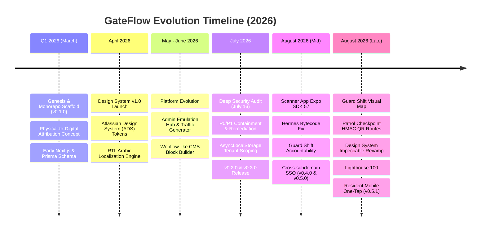

# NOTEBOOKLM SOURCE 11: GateFlow Full Historical Evolution (Day 1 to Present) & Master AI Context Data

---

## 1. Executive Summary & Purpose

This document serves as the **definitive historical and contextual chronicle of the GateFlow platform** from its inception (**Day 1 / Q1 2026**) through its current milestone (**v0.5.1 / August 31, 2026**).

It is engineered as a zero-loss, high-density reference source specifically formatted for **Google NotebookLM**, as well as multi-CLI and external AI agent systems (Claude, Cursor, Gemini, Opencode, Kiro, Kilo, Qwen, Antigravity).

---

## 2. Chronological Platform History (Day 1 to Present)



---

### Phase 1: Genesis & Foundational MVP (March 2026 — v0.1.0)

- **The Problem Statement:** Gated residential compounds and commercial properties across the MENA region suffered from insecure paper/WhatsApp guest logs, slow guard check-in bottlenecks, zero marketing attribution for property developers, and lack of native Arabic RTL support.
- **Initial Architecture:**
  - Scaffolded a Turborepo monorepo managed with `pnpm`.
  - Core database schema modeled in PostgreSQL via Prisma ORM (`packages/db`).
  - Implemented the first iteration of JWT authentication with Argon2id password hashing.
  - Basic QR pass generation and verification endpoints.
  - Initial `marketing` site with SEO title templating, localized meta tags, and JSON-LD schema.

---

### Phase 2: Design System v1.0 & Multi-Surface Expansion (April 2026 — v1.0.0)

- **Design System Launch:**
  - Published the canonical `@gateflow/ui`, `@gateflow/tokens`, `@gateflow/theme`, and `@gate-access/components` packages.
  - Adopted Atlassian Design System (ADS) semantic token conventions.
  - Implemented the **Kimchi Palette**, deep dark mode (#111112, #191a1c), and unified 6px/12px border radii.
  - Built [design.gateflow.site](https://design.gateflow.site) with live component previews, token explorers, and RTL/LTR live toggles.
- **Multi-App Expansion:**
  - Spun up dedicated application surfaces: `client-dashboard`, `admin-dashboard`, `scanner-app`, `resident-mobile`, `resident-portal`, `marketing`, and `design-system`.
  - Enforced a strict architectural rule: **no direct app-to-app imports**, routing all shared logic through `packages/*`.

---

### Phase 3: Platform Evolution & Admin Emulation (May – June 2026)

- **Organization Provisioning & Hierarchy:**
  - Added `OrganizationType` enum support (Residential, Commercial, Educational, Mixed-Use).
  - Built self-serve organization creation, role assignment, and project scoping.
- **Traffic Emulation Hub v4.0:**
  - Built an in-engine simulation engine inside `admin-dashboard` capable of synthesizing thousands of realistic guest check-ins, QR scans, guard shifts, and incident reports for load testing and client demos.
- **CMS Shell & Visual Page Builder:**
  - Implemented a 9-block modular CMS block builder for marketing and documentation pages, featuring real-time preview, version history, and draft/publish workflows.

---

### Phase 4: Deep Security Audit & Zero-Trust Hardening (July 2026 — v0.2.0 & v0.3.0)

On **July 16, 2026**, GateFlow underwent a comprehensive, source-level engineering and security audit (`GATEFLOW_DEEP_AUDIT_2026-07-16.md`). Critical findings were triaged into immediate P0/P1 remediation plans (`audit_remediation_2026`):

1. **P0 Remediation — Backdoor Route Removal:**
   - Deleted `/api/setup/reset-admin/route.ts` which contained a hard-coded fallback secret and static password hashes. Replaced it with a secure, local interactive CLI.
2. **P0 Remediation — Cron Fail-Open Closure:**
   - Fixed `/api/cron/ai-tasks/route.ts` to strictly fail closed with constant-time Bearer token verification when `CRON_SECRET` is missing.
3. **P1 Remediation — Workspace Deletion Authorization:**
   - Secured `/api/danger/delete-workspace/route.ts` with mandatory `workspace:manage` RBAC permission checks.
4. **P1 Remediation — Request-Local AsyncLocalStorage Tenant Scoping:**
   - Wrapped database interactions in request-local `AsyncLocalStorage` (`tenant.ts`), ensuring queries automatically inherit and enforce `organizationId` boundaries.
5. **Dependency Vulnerability Overrides:**
   - Resolved 16 high/critical npm advisories via `pnpm.overrides`.

---

### Phase 5: Guard Operations, Native Mobile & Cross-Subdomain SSO (August 2026 — v0.4.0 & v0.5.0)

- **Scanner App Overhaul:**
  - Upgraded to Expo SDK 57 and resolved React Native Metro / Hermes bytecode compilation issues.
  - Implemented `BiometricGuard` with inactivity auto-lock and fail-closed PIN authentication.
  - Added Guard Shift Accountability: enforced mandatory shift start, gate assignment, handover notes, and scan logging linked to active shift IDs.
- **Cross-Subdomain SSO:**
  - Configured shared authentication cookies across `Domain=.gateflow.site` enabling single sign-on between `app.gateflow.site` (Client) and `portal.gateflow.site` (Resident).
- **Guard Shift Visual Map & Patrol Checkpoints:**
  - Added live terminal occupancy grid, active shift counters, and handover drawer to Client Dashboard.
  - Built perimeter patrol routes, physical HMAC QR checkpoint scanning, and real-time map telemetry.

---

### Phase 6: Design System Revamp, Lighthouse 100 & Resident One-Tap (August 28–30, 2026 — v0.5.1)

- **Design System Impeccable Revamp:**
  - Implemented 3-tier token architecture (foundations, semantic `ds` namespace, component tokens).
  - Introduced OKLCH Satin-Charcoal Dark Mode (`--ds-layer-01` to `--ds-layer-04`) with Porcelain light mode.
  - Calibrated enterprise corner radii (`4px` to `16px`), eliminating bubbly borders.
  - Added FormField (controller & standalone), Badge (5 variants, 7 tones), Card, DynamicTable mobile card transform, and Vibe-Check AI sandbox.
- **Lighthouse 100 Performance Overhaul:**
  - Achieved zero CLS and 98+ Desktop / 95+ Mobile scores across all monorepo apps.
  - Introduced `DynamicIsland` primitives, font preloading, and `.lighthouserc.js` CI hard-gates.
- **Resident Mobile One-Tap Experience:**
  - $\le 800\text{ms}$ biometric unlock, fail-closed local PIN fallback, vector HMAC QR generation, 3-tap pass sharing, and interactive arrival alerts ($\le 3\text{s}$).

---

## 3. Comprehensive System Architecture & Topology

```text
┌─────────────────────────────────────────────────────────────────────────────────────────────────┐
│                                    GATEFLOW SYSTEM TOPOLOGY                                     │
├─────────────────────────────────────────────────────────────────────────────────────────────────┤
│  APPLICATIONS LAYER                                                                             │
│  ┌──────────────────────┐  ┌──────────────────────┐  ┌──────────────────────┐                   │
│  │ client-dashboard     │  │ admin-dashboard      │  │ resident-portal      │ (Next.js 16)      │
│  │ (Property Console)   │  │ (Platform Plane)     │  │ (Web Guest Pass)     │                   │
│  └──────────┬───────────┘  └──────────┬───────────┘  └──────────┬───────────┘                   │
│  ┌──────────┴───────────┐  ┌──────────┴───────────┐  ┌──────────┴───────────┐                   │
│  │ marketing            │  │ scanner-app          │  │ resident-mobile      │ (Next.js / Expo)  │
│  │ (Attribution / CMS)  │  │ (Guard Field Scan)   │  │ (Native Mobile Pass) │                   │
│  └──────────┬───────────┘  └──────────┬───────────┘  └──────────┬───────────┘                   │
├─────────────┼─────────────────────────┼─────────────────────────┼───────────────────────────────┤
│  SHARED PACKAGES LAYER                │                         │                               │
│  ┌──────────▼───────────┐  ┌──────────▼───────────┐  ┌──────────▼───────────┐                   │
│  │ @gate-access/ui      │  │ @gate-access/types   │  │ @gate-access/i18n    │                   │
│  │ (Radix / ADS Tokens) │  │ (DTOs / Enums)       │  │ (Arabic RTL / En)    │                   │
│  └──────────────────────┘  └──────────────────────┘  └──────────────────────┘                   │
│  ┌──────────────────────┐  ┌──────────────────────┐  ┌──────────────────────┐                   │
│  │ @gate-access/utils   │  │ @gate-access/stripe  │  │ @gate-access/ai      │                   │
│  │ (HMAC / AES-GCM)     │  │ (Subscriptions)      │  │ (GateAI Assistant)   │                   │
│  └──────────────────────┘  └──────────────────────┘  └──────────────────────┘                   │
├─────────────────────────────────────────────────────────────────────────────────────────────────┤
│  DATA & INFRASTRUCTURE LAYER                                                                    │
│  ┌──────────────────────────────────────────────────────────────────────────┐                   │
│  │ @gate-access/db (Prisma ORM 6.19.3)                                      │                   │
│  │  ├── Runtime App Pools: Prisma Accelerate (prisma+postgres://...)        │                   │
│  │  └── Direct Sockets: DIRECT_DATABASE_URL (Migrations, CLI Seeds)         │                   │
│  └──────────────────────────────────────────────────────────────────────────┘                   │
└─────────────────────────────────────────────────────────────────────────────────────────────────┘
```

---

## 4. Master Application Surface Map

| Surface              | Path                    | Tech Stack                                   | Primary Responsibilities                                                                                                                             |
| :------------------- | :---------------------- | :------------------------------------------- | :--------------------------------------------------------------------------------------------------------------------------------------------------- |
| **Client Dashboard** | `apps/client-dashboard` | Next.js 16, React 19, Tailwind CSS, Recharts | Core property management console: resident CRM, unit mapping, guest pass creation, gate monitoring, real-time analytics, billing settings.           |
| **Admin Dashboard**  | `apps/admin-dashboard`  | Next.js 16, React 19, Tailwind CSS           | Platform super-admin control plane: organization provisioning, global key management, emulation hub, CMS block publishing, audit log exports.        |
| **Scanner App**      | `apps/scanner-app`      | React Native, Expo SDK 57, VisionCamera      | High-speed mobile application for gate security guards: offline HMAC validation, QR scan-to-decision (< 200ms), shift management, incident creation. |
| **Resident Mobile**  | `apps/resident-mobile`  | React Native, Expo SDK 57                    | Native mobile self-service app for compound residents: one-tap guest pass sharing (WhatsApp/SMS), visitor history, biometric lock.                   |
| **Resident Portal**  | `apps/resident-portal`  | Next.js 16, React 19, Tailwind CSS           | Web/PWA equivalent for residents: desktop pass management, service requests, localized bilingual interface.                                          |
| **Marketing Site**   | `apps/marketing`        | Next.js 16, Tailwind CSS, Content Engine     | Public marketing presence, dynamic CMS landing pages, interactive calculators, lead capture, digital-to-physical attribution.                        |
| **Design System**    | `apps/design-system`    | Next.js / Storybook                          | Living component documentation, design tokens viewer, accessibility tests, interactive RTL/LTR validation.                                           |

---

## 5. Security Invariants & Cryptographic Reference

### 5.1 Multi-Tenant Request Isolation (Fail-Closed)

- Database queries must execute within an `AsyncLocalStorage` tenant context containing `organizationId`.
- Unscoped queries thrown at the database layer result in an immediate `TenantIsolationViolationError`.
- **Soft-Delete Contract:** All entity queries on models containing `deletedAt` must append `deletedAt: null`. Operational hard deletes are forbidden.

### 5.2 Cryptographic Pass Generation & Validation

- Passes use cryptographic HMAC-SHA256 signing with `qrId` (the QRCode database record ID) included in the signed payload:
  $$\text{QR Token} = \text{Base64Url}(\text{qrId} \cdot \text{organizationId} \cdot \text{type} \cdot \text{maxUses} \cdot \text{expiresAt} \cdot \text{issuedAt} \cdot \text{nonce}) + \text{"."} + \text{HMAC-SHA256}(\dots)$$
- The `qrId` is part of the signed payload and must match the database record ID; short URLs are provided for copy/share purposes only and do not replace the signed QR verification.
- Mobile scanners maintain encrypted keys in device SecureStore for offline evaluation.
- Anti-replay logic checks `nonce` against local and remote `ScanLog` tables.

### 5.3 Authentication & Session Protocols

- **Access Token:** 15-minute ephemeral signed JWT (`jose`).
- **Refresh Token:** 30-day encrypted token stored in `httpOnly`, `SameSite=Lax`, `Secure` cookies.
- **SSO Domain:** `AUTH_COOKIE_DOMAIN=.gateflow.site` synchronizes sessions across client and resident web portals. JWT configuration and `NEXTAUTH_SECRET` must match across all subdomains sharing SSO, in addition to the shared cookie domain.
- **CSRF Defense:** Double-submit cookie pattern with custom header validation on all mutations.

---

## 6. Development Lifecycle, Gitflow & AI Tool Orchestration

### 6.1 Branching & Commit Discipline

- **Branch Naming Standard:** `^(feat|fix|chore|hotfix|refactor|docs|test|perf|ci|security)(/.+)?$`
- **Commit Format:** Conventional Commits (`type(scope): subject`).
- **Preflight Enforcer:** `pnpm preflight` runs changelog checks, ADS token validation, bootstrap route checks, Turborepo lint, typecheck, and unit tests.

### 6.2 The Phased Initiative Lifecycle

```text
docs/plan/Draft/      ──[ /plan ]──>   docs/plan/Ready/
                                             │
                                         [ /dev ]
                                             ▼
docs/plan/Complete/   <──[ /ship ]──   docs/plan/Active/
```

- **Draft:** Conceptual requirements, brainstorming notes, raw initiatives.
- **Ready:** Sequenced implementation plan (`PLAN_<slug>.md`) and per-phase pro prompts.
- **Active:** Currently being implemented. Strictly one active phase at a time per subagent.
- **Complete:** 100% implemented, verified with tests, certified, and merged.

### 6.3 AI Multi-CLI Brain & Limit Management

The repository supports unified cross-tool development across Cursor, Claude CLI, Gemini CLI, Opencode, Kiro, Kilo, and Qwen:

- AI rules and skills are canonically authored in `.agents/` and synchronized via `pnpm sync`.
- Token consumption is monitored via `CLI_LIMITS_TRACKING.md`. Tools at **80%+ limit** are hard-locked until authorized.
- Ralph perspective scripts automate task prioritization, pattern discovery, and git release merges.

---

## 7. Master Context Quick-Reference for AI Models

```typescript
// CORE INVARIANTS CHEAT-SHEET FOR AI GENERATION:
// 1. Prisma Scoping: ALWAYS include { organizationId: ctx.orgId }; add deletedAt: null ONLY for models that define deletedAt
// 2. Auth Context: Use requireAuth(req) or getSession() returning { userId, orgId, role }
// 3. UI Styling: Use tokens from @gate-access/ui (e.g. bg-background, text-foreground)
// 4. Localization: Wrap copy in useTranslation() or dict[locale] with RTL support
// 5. Scan Logging: ScanLog is strictly APPEND-ONLY (no updates/deletes permitted)
// 6. DB Connections: App code uses Prisma Accelerate; migrations use DIRECT_DATABASE_URL
```
