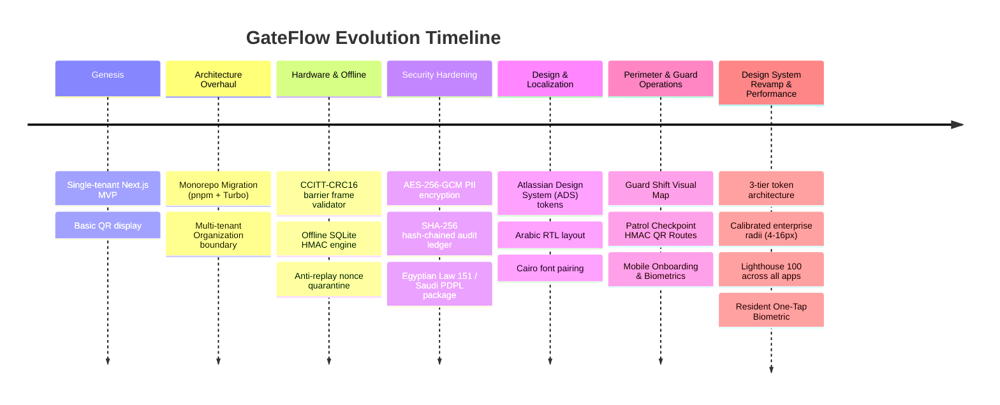

# GateFlow — Master Knowledge Base & Complete Context Reference (Day 1 to Present)

> **Universal Source Document for External AI Engines**: Grok, Google NotebookLM, Claude 3.5/Opus, ChatGPT-4o/o1, Gemini 1.5 Pro  
> **Repository**: `iDorgham/Gateflow` (Gate-Access Monorepo)  
> **Workspace Version**: `0.5.1`  
> **PRD Version**: `v13.0`  
> **Production Target**: `https://*.gateflow.site`  
> **Last Comprehensive Audit**: August 31, 2026

---

## 1. Executive Summary & Problem Domain

**GateFlow** is an enterprise-grade physical security automation and gated-community operations SaaS platform engineered specifically for the MENA region (Egypt, Saudi Arabia, UAE, Qatar) and global smart facilities.

### Core Problems Solved

1. **Manual Guard Logbook Inefficiencies**: Replaced with optical QR code scans (<120ms verification latency) and automated barrier triggers.
2. **Internet Dependency in Security Gates**: Offline-first verification engine allows guards and gate barriers to validate HMAC-SHA256 QR passes and prevent replay attacks even when disconnected from the cloud.
3. **Data Privacy & MENA Compliance**: End-to-end alignment with Egyptian Personal Data Protection Law (Law 151 of 2020) and Saudi PDPL regulations, featuring AES-256-GCM field encryption for PII and tamper-evident SHA-256 chained audit logs.
4. **Bilingual Arabic/English Experience**: Native right-to-left (RTL) layout with Cairo Arabic typography and unified cross-subdomain `.gateflow.site` language/theme persistence.
5. **Perimeter Situational Awareness**: Live guard shift visual map, real-time terminal occupancy, cryptographically verified perimeter patrol routes, and resident one-tap biometric passes.

---

## 2. Full History & Monorepo Evolution (Day 1 to Present)



- **Phase 1 (Genesis)**: Single-tenant Next.js prototype with simple QR generation for residential gate access.
- **Phase 2 (Monorepo & Multi-Tenancy)**: Transitioned to a pnpm + Turborepo monorepo separating `marketing`, `client-dashboard`, `admin-dashboard`, `resident-portal`, `design-system`, `scanner-app`, and `resident-mobile`. Introduced `Organization` root multi-tenancy.
- **Phase 3 (Cryptographic Access & Hardware Relays)**: Implemented cryptographic HMAC-SHA256 QR signing with deterministic `qrId` binding, anti-replay nonce windows, and CCITT-CRC16 framed TCP/serial barrier relay controllers.
- **Phase 4 (Enterprise Compliance & Security)**: Integrated AES-256-GCM envelope encryption for sensitive fields, SHA-256 tamper-evident chained audit trails, and step-up MFA challenge modals for privileged mutations.
- **Phase 5 (ADS Design System & MENA Regionalization)**: Standardized on Atlassian Design System (ADS) token semantics (`@gateflow/theme`), bidirectional Arabic RTL layouts, and Egyptian Arabic copywriting.
- **Phase 6 (Perimeter Guard Telemetry & Mobile Onboarding)**:
  - **Guard Shift Visual Map**: Live gate terminal occupancy, active shift duration counters, terminal health indicators, and shift handover controls.
  - **Perimeter Guard Patrol Checkpoints**: Cryptographic HMAC QR checkpoint routes, live polyline map telemetry, and supervisor compliance reporting.
  - **Scanner App Onboarding & Biometric Guard**: 4-step first-mile wizard, fail-closed biometric/PIN vault in SecureStore, 5-minute background inactivity lock, and redesigned 72x72px Master Scan FAB.
- **Phase 7 (Design System Revamp & Lighthouse 100 Performance)**:
  - **Design System Impeccable Revamp**: 3-tier token architecture (foundations, semantic, component), OKLCH Satin-Charcoal Dark Mode (`--ds-layer-01` to `--ds-layer-04`), switchable Cobalt/Emerald accents, 19/19 WCAG 2.2 AA contrast, calibrated enterprise radii scale (`4px`–`16px`), and Vibe-Check AI sandbox.
  - **Lighthouse 100 & Zero-CLS**: 5-phase performance overhaul across all applications, zero-CLS `DynamicIsland` primitives, font preloading, and `.lighthouserc.js` CI hard-gates.
  - **Resident Mobile One-Tap Biometrics**: $\le 800\text{ms}$ biometric unlock, fail-closed PIN fallback, vector HMAC QR, 3-tap visitor pass sharing, interactive arrival alerts ($\le 3\text{s}$).

---

## 3. Monorepo Topology & Codebase Structure

```
Gate-Access/
├── apps/
│   ├── marketing/           # Public portal, SEO, pricing, lead generation (Next.js 14 App Router, Port 3000)
│   ├── client-dashboard/    # Facility operations, QR studio, GateAI concierge, CRM (Next.js 14, Port 3001)
│   ├── admin-dashboard/     # SuperAdmin tenant governance, billing, telemetry (Next.js 14, Port 3002)
│   ├── resident-portal/     # Resident PWA for visitor pass creation & entry tracking (Next.js 14, Port 3004)
│   ├── design-system/       # Interactive ADS component showcase & token catalog (Next.js 14, Port 3004)
│   ├── scanner-app/         # Security guard native barrier controller (Expo SDK 57, React Native)
│   └── resident-mobile/     # Resident native smartphone key & biometrics (Expo SDK 57, React Native)
│
├── packages/
│   ├── db/                  # Prisma schema (67 models), PostgreSQL migrations, singleton client
│   ├── theme/               # @gateflow/theme: ADS tokens, next-themes, synchronous cookie sync
│   ├── i18n/                # @gate-access/i18n: Shared Arabic/English locale cookie helpers
│   ├── ui/                  # @gate-access/ui: Shared component primitives & native token exports
│   ├── security/            # @gate-access/security: AES-256-GCM, HMAC-SHA256, Audit ledger
│   ├── config/              # Shared ESLint, Prettier, TypeScript, and Tailwind configurations
│   └── types/               # Shared domain interfaces, patrol models, and API payload types
│
├── docs/                    # Architecture, PRDs, audits, planning backlog, references, notebooklm
├── scripts/                 # AI synchronization, preflight checks, CI automation, db migrate
└── .github/workflows/       # Automated CI/CD (deploy.yml, ci.yml, security-scan.yml)
```

---

## 4. Comprehensive Database Schema & Entity Dictionary

GateFlow's database tier runs on **PostgreSQL** managed by **Prisma 5.x** with 67 models and 41 enums:

### Core Entity Relationships

| Model                  | Multi-Tenancy Scope (`organizationId`) | Soft Delete (`deletedAt`) | Description                                                                                                                  |
| :--------------------- | :------------------------------------- | :------------------------ | :--------------------------------------------------------------------------------------------------------------------------- |
| **`Organization`**     | Tenant Root                            | ✓                         | Top-level tenant boundary. Holds billing tier (`FREE`, `STARTER`, `PRO`, `ENTERPRISE`), domain slugs, and security settings. |
| **`Project`**          | ✓                                      | ✓                         | Physical gated community, residential compound, or enterprise facility.                                                      |
| **`User`**             | ✓                                      | ✓                         | Dashboard operator or staff member with role (`SUPERADMIN`, `ORG_OWNER`, `ORG_ADMIN`, `GUARD`, `CONCIERGE`).                 |
| **`Resident`**         | ✓                                      | ✓                         | Occupant profile associated with one or more `Unit` records; authorized to generate visitor passes.                          |
| **`Unit`**             | ✓                                      | ✓                         | Physical apartment, villa, or office suite within a `Project`.                                                               |
| **`VisitorPass`**      | ✓                                      | ✓                         | Time-bounded guest invitation with guest name, phone, plate number, and HMAC-SHA256 signature.                               |
| **`QRCode`**           | ✓                                      | ✓                         | Cryptographic QR code record with hashed payload, nonces, and scan limits.                                                   |
| **`Gate`**             | ✓                                      | ✓                         | Physical entrance/exit barrier lane linked to hardware relay controller and IP/serial scanner.                               |
| **`GateAssignment`**   | ✓                                      | ✓                         | Active mapping between security guards, shifts, and assigned physical gates.                                                 |
| **`ShiftLog`**         | ✓                                      | —                         | Guard shift start/end timestamps, assigned terminal, and summary scan counters.                                              |
| **`PatrolRoute`**      | ✓                                      | ✓                         | Defined guard patrol loop with ordered sequence of physical checkpoints and expected schedule.                               |
| **`PatrolCheckpoint`** | ✓                                      | ✓                         | Physical checkpoint beacon/sign with cryptographic HMAC-signed QR token and GPS coordinates.                                 |
| **`PatrolLog`**        | ✓                                      | —                         | Recorded guard patrol session with compliance status (`ON_TIME`, `DELAYED`, `INCOMPLETE`).                                   |
| **`CheckpointScan`**   | ✓                                      | —                         | Individual checkpoint scan verification event with timestamp and guard proof.                                                |
| **`ScanLog`**          | —                                      | —                         | High-throughput access log storing scan timestamps, gate IDs, outcomes (`GRANTED`, `DENIED_*`), and guard IDs.               |
| **`AuditLog`**         | ✓                                      | —                         | Cryptographically chained audit record (`prevHash` linking) tracking all administrative mutations.                           |
| **`WorkOrder`**        | ✓                                      | ✓                         | Maintenance tickets automatically delegated by GateAI concierge or manually by facility admins.                              |
| **`ApiKey`**           | ✓                                      | —                         | Programmatic integration API keys with granular permission scopes and SHA-256 secret hashing.                                |
| **`Webhook`**          | ✓                                      | ✓                         | Event subscription endpoints with HMAC-SHA256 signature delivery validation.                                                 |
| **`AiTask`**           | ✓                                      | —                         | Background autonomous AI job queue (incident triage, automated shift reports).                                               |

---

## 5. GitFlow & Monorepo Quality Baseline

- **Package Manager**: Strictly `pnpm` (`v9.x`).
- **Preflight Gate**: `pnpm preflight` running across all 7 applications and 7 packages with **100% Green pass rate (15/15 Turbo tasks)**.
- **Unit Testing**:
  - `client-dashboard`: 117 test suites (696 unit tests).
  - `scanner-app`: 26 test suites (209 unit tests).
- **Branching Policy**:
  - `master`: Production branch (Continuous deployment via Vercel).
  - Conventional commits enforced via Husky + commitlint (`feat`, `fix`, `chore`, `docs`, `refactor`).
  - No bulk `git add .`; focused authorized slice commits only.
