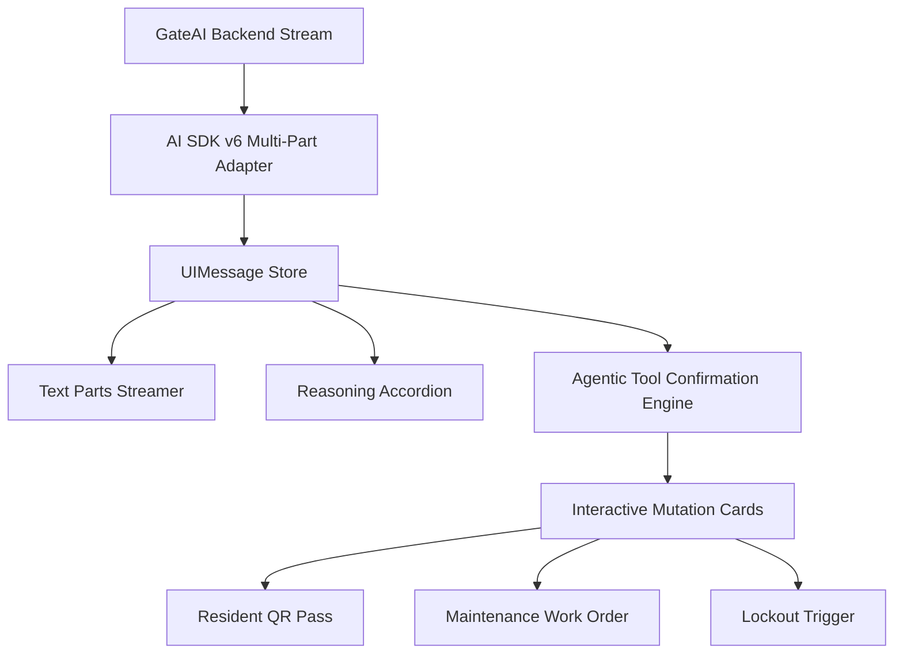

# PLAN: AI SDK v6 (Agentic) Architecture Migration

- **Initiative:** `ai_sdk_v6_migration`
- **Application:** Cross-Platform (`apps/client-dashboard`, `apps/admin-dashboard`, `packages/ai-client`)
- **Status:** ✅ Complete — all phases 1–5 complete (verified)
- **Priority:** P1 — Core AI Infrastructure & Agentic Extensibility
- **Branch:** `feat/ai-sdk-v6-migration`

---

## 1. Executive Summary

Migrate the GateFlow AI Assistant infrastructure to the modern Vercel AI SDK v6 "Agentic" architecture. This migration transitions chat message rendering from legacy flat string content to the rich multi-part `UIMessage` standard (`text`, `tool-invocation`, `reasoning`), formalizes interactive client-side tool execution lifecycles (`requires-action`, `executing`, `completed`), and eliminates all deprecation warnings while ensuring zero regression in existing operational capabilities.

---

## 2. Core Technical Scope

---

## 3. Phased Implementation Plan

### Phase 1: Multi-Part `UIMessage` Data Transformers & Adapter

- **Primary Role:** BACKEND-API / ARCHITECTURE
- **Preferred Tool:** Cursor IDE
- **Scope:**
  - Build universal multi-part stream parser and type-safe adapter for AI SDK v6 `UIMessage` structures (`type: 'text' | 'tool-invocation' | 'reasoning'`).
  - Implement zero-deprecation fallback parser transforming legacy message structures into normalized multi-part items.
  - Write unit tests for stream chunk transformations and part extraction.

### Phase 2: Agentic Tool Invocation & Confirmation State Machine

- **Primary Role:** FULLSTACK / SECURITY
- **Preferred Tool:** Cursor IDE
- **Scope:**
  - Implement tool execution state machine supporting interactive user confirmation (`state: 'requires-action' | 'executing' | 'completed' | 'rejected'`).
  - Enforce tenant isolation (`organizationId`) and audit logging metadata for all tool executions.
  - Write unit tests for tool lifecycle transitions, execution handlers, and permission denials.

### Phase 3: Client Dashboard AI Assistant Migration

- **Primary Role:** FRONTEND / UI
- **Preferred Tool:** Cursor IDE
- **Scope:**
  - Upgrade `ai-assistant.tsx` to utilize the v6 agentic hooks (`sendMessage`, `status: 'ready' | 'submitted' | 'streaming' | 'error'`).
  - Render interactive mutation cards for pass creation, gate telemetry inspection, and unit directory search.
  - Write unit tests for client dashboard assistant chat state and interactive tool cards.

### Phase 4: Admin Dashboard AI Assistant & Super-Admin Emulation Tools

- **Primary Role:** FRONTEND / FULLSTACK
- **Preferred Tool:** Cursor IDE
- **Scope:**
  - Upgrade `admin-ai-assistant.tsx` to v6 multi-part architecture.
  - Implement super-admin agentic tools (mock data emulation trigger, system security diagnostics, cross-compound analytics query).
  - Write unit tests for admin assistant state and super-admin tool calling cards.

### Phase 5: Arabic RTL Polish, Latency Benchmarks & Full Certification

- **Primary Role:** QA / DESIGN
- **Preferred Tool:** Opencode CLI
- **Scope:**
  - Audit Arabic RTL layout fidelity across all tool confirmation cards and reasoning stream bubbles.
  - Benchmark streaming token latency ($< 150$ms time-to-first-token).
  - Run full test suites across all affected applications and verify zero lint warnings.

---

## 4. Success Criteria

1. 100% compliant multi-part `UIMessage` parsing and rendering.
2. Interactive tool calling confirmation cards for high-impact mutations.
3. 0 TypeScript errors and 0 lint warnings across `apps/client-dashboard` and `apps/admin-dashboard`.
4. Comprehensive unit test suites covering message adapters, tool lifecycles, and dashboard components.
