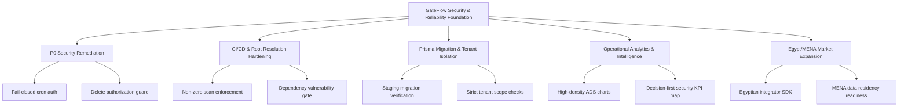

# PLAN: GateFlow Readiness and Egypt/MENA Market Leadership 2026

- **Initiative:** `gateflow_readiness_market_leadership_2026`
- **Application:** Cross-Platform (`packages/db`, `apps/client-dashboard`, `apps/admin-dashboard`, `apps/scanner-app`)
- **Status:** 🟡 In-Progress — Phase 1 (Queued for `/dev gateflow_readiness_market_leadership_2026 1`)
- **Priority:** P0 — Enterprise Security, Platform Reliability & Market Leadership
- **Branch:** `feat/gateflow-readiness-market-leadership-2026`

---

## 1. Executive Summary

Prepare GateFlow for institutional-grade reliability, security certifications, and Egypt-first market expansion. Remediate all critical audit findings (bootstrap attack surface, fail-closed cron authentication, destructive action permissions), enforce trustworthy CI script resolution and non-zero scans, establish migration safety drills, deploy high-density operational dashboard analytics with decision-first charts, and certify Egypt pilot integration workflows.

---

## 2. Architecture & Strategic Pillars

---

## 3. Phased Implementation Plan

### Phase 1: P0 Security & Exposure Remediation

- **Primary Role:** SECURITY / BACKEND-API
- **Preferred Tool:** Cursor IDE
- **Scope:**
  - Enforce fail-closed authentication and request signature verification on all automated background tasks and cron jobs.
  - Implement granular authorization guards on high-risk destructive routes (workspace deletion, resident pass bulk-revocation, credential resets).
  - Add regression test suites for permission policies and unauthorized mutation rejections.

### Phase 2: CI/CD, Script Resolution & Dependency Gate Hardening

- **Primary Role:** DEVOPS / ARCHITECTURE
- **Preferred Tool:** Cursor IDE
- **Scope:**
  - Standardize script root path resolution across all monorepo checks (`scripts/` vs repository root).
  - Implement non-zero scan regression verification preventing false-positive passing checks.
  - Establish automated preflight dependency advisory audits and SemVer release discipline.

### Phase 3: Prisma Migration Safety, Data Retention & Tenant Scoping

- **Primary Role:** BACKEND-DATABASE / SECURITY
- **Preferred Tool:** Cursor IDE
- **Scope:**
  - Build migration verification engine utilizing `DIRECT_DATABASE_URL` with pre-flight dry runs and rollback drill contracts.
  - Implement automated multi-tenant query auditor verifying mandatory `organizationId` and `deletedAt: null` clauses across all ORM models.
  - Formalize data retention and GDPR/Egyptian data privacy compliance policies.

### Phase 4: Operational Dashboard Analytics & Security Intelligence

- **Primary Role:** FRONTEND / UI
- **Preferred Tool:** Cursor IDE
- **Scope:**
  - Implement high-density decision-first operational dashboard widgets with ADS tokens and accessible fallbacks.
  - Build security health map, gate traffic throughput charts, and anomaly detection feeds.
  - Ensure 100% Arabic RTL layout compliance and zero layout shifts.

### Phase 5: Egypt Pilot Wedge, Partner Integration & MENA Readiness Certification

- **Primary Role:** QA / FULLSTACK
- **Preferred Tool:** Opencode CLI
- **Scope:**
  - Build Egyptian hardware integrator adapter and offline-first gate sync verifier.
  - Execute full automated test suite across all affected applications.
  - Verify zero TypeScript errors and zero lint warnings.

---

## 4. Success Criteria

1. 100% remediation of P0/P1 security audit findings with automated test verification.
2. Verified non-zero CI scanning and deterministic script execution.
3. Fully tenant-scoped operational analytics with ADS styling and Arabic RTL fidelity.
4. Comprehensive test suites passing with zero errors across the monorepo.
