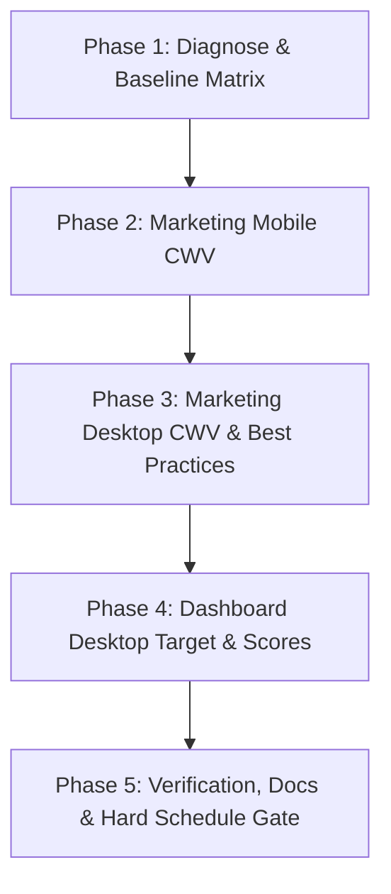

# Plan: Lighthouse & Performance (Mobile + Desktop) (`lighthouse_perf_mobile_desktop`)

**Slug:** `lighthouse_perf_mobile_desktop`  
**Domain:** Code · Frontend / Performance  
**Primary Surfaces:** `apps/marketing`, `apps/client-dashboard` (+ `packages/ui` if shared)  
**Status:** 🟢 Complete — All 5 Phases Certified  
**Branch:** `feat/lighthouse-perf-mobile-desktop`

---

## 1. Overview & Objectives

Scheduled Lighthouse CI on `master` must pass for **marketing (mobile + desktop)** and **dashboard (desktop)** by fixing root Core Web Vitals bottlenecks and establishing intentional audit targets—maintaining strict hard-failing regression checks without lowering assertion thresholds.

### Success Criteria

- Daily cron Lighthouse CI hard-passes with all assertions met.
- `apps/marketing` achieves Performance ≥ 0.65 (target 0.85+), Accessibility ≥ 0.85, Best Practices ≥ 0.88, SEO ≥ 0.90 on mobile & desktop.
- `apps/client-dashboard` achieves Performance ≥ 0.65, Accessibility ≥ 0.85, Best Practices ≥ 0.88 on desktop.
- LCP ≤ 2500ms, TBT ≤ 200ms, CLS ≤ 0.15 across audited routes.
- Full evidence matrix published to `docs/guides/performance/`.

---

## 2. Phase Breakdown

### Phase 1: Diagnose & Baseline Matrix

- **Goal:** Run LHCI diagnostics across targeted routes and document the exact baseline failure matrix (URL × Form Factor × Metrics).
- **Scope:** Actions run logs analysis, local `@lhci/cli` runs, and audit of `/en` → `/en/login` redirect behavior.
- **Deliverables:** `docs/guides/performance/BASELINE_lighthouse_matrix.md`.
- **Primary Role:** EXPLORE / FRONTEND | **Preferred Tool:** Cursor / Claude Code CLI

### Phase 2: Marketing Mobile Core Web Vitals

- **Goal:** Fix mobile LCP, font blocking, image formats, and layout shifts in `apps/marketing`.
- **Scope:** `hero-animated-content.tsx` (remove `initial="hidden"` on LCP headline), font definition (`display: 'swap'` and weight pruning), convert critical assets to WebP/AVIF, set explicit image dimensions, use `dvh` for mobile viewports.
- **Deliverables:** Optimized marketing mobile components and updated layout.
- **Primary Role:** FRONTEND | **Preferred Tool:** Cursor / OpenCode CLI

### Phase 3: Marketing Desktop CWV & Best Practices

- **Goal:** Optimize desktop performance, bundle sizes, security headers/meta, and SEO on marketing routes.
- **Scope:** Dynamic imports for below-the-fold components (pricing comparison, interactive demos), preconnect hints for third-party origins, clean console/CSP errors, meta descriptions/canonical tags.
- **Deliverables:** Desktop bundle isolation and verified desktop LHCI scores.
- **Primary Role:** FRONTEND | **Preferred Tool:** Cursor / OpenCode CLI

### Phase 4: Dashboard Desktop Target & Performance Optimization

- **Goal:** Ensure client dashboard audit target is intentional, fast, and compliant with `.lighthouserc.js` floors.
- **Scope:** Optimize public login page (`/en/login`), restrict `remotePatterns` in `next.config.js`, dynamically import heavy chart packages (`recharts`), configure Suspense streaming boundaries.
- **Deliverables:** Optimized dashboard public routes and config.
- **Primary Role:** FRONTEND / DEVOPS | **Preferred Tool:** Cursor / Claude Code CLI

### Phase 5: Verification, Documentation & Hard Schedule Gate

- **Goal:** Execute full LHCI assertion suite locally and in CI, record before/after comparison docs, and certify hard-fail gate.
- **Scope:** End-to-end LHCI verification on both mobile and desktop, update `docs/guides/performance/`, verify GitHub Actions workflow configuration.
- **Deliverables:** `docs/guides/performance/LIGHTHOUSE_PERF_CERTIFICATION.md` and green CI.
- **Primary Role:** QA / FRONTEND | **Preferred Tool:** Cursor / Gemini CLI
