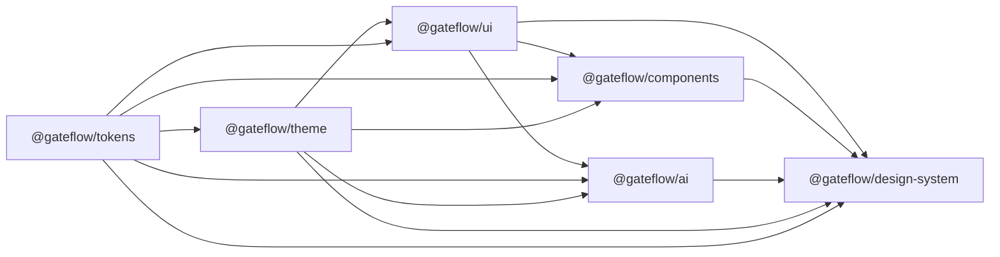

# PLAN: GateFlow Design System (OKLCH tokens, theme, UI, docs site)

**Slug:** `design_system`  
**Canonical initiative context:** `docs/development/initiatives/IDEA_atlassian_ui_remake.md` (evolved into a **multi-reference** system below).  
**Related docs:** `docs/guides/UI_COMPONENT_LIBRARY.md`, `docs/reference/architecture/PROJECT_STRUCTURE.md`, `docs/archive/legacy/PRD_v7.0.md` (historical product framing).  
**Public marketing / brand reference:** [gateflow.site](https://www.gateflow.site) — enterprise gate security, MENA compounds, trust/performance framing, EN/AR.

**Status:** Planned — prompts live under `phases/NN_<title>/PROMPT_phase_NN.md`. Execute with `/dev gateflow_design_system <phase>` (1–10 in order) or `/ship` per `docs/development/PLAN_LIFECYCLE.md` (moves `planned/` → `in-progress/` → `done/`).

**Target:** Q2–Q3 2026  
**Primary stack:** OKLCH + CSS relative color syntax, Tailwind CSS v4 + Lightning CSS (design-system app from **Phase 6** onward), `data-color-mode` + `next-themes`, Turborepo: **`tokens` → `theme` → `ui` → `components` → `ai` → `design-system` app → docs content → deploy → npm**.

---

## Vision

Deliver the **canonical GateFlow design system**: **`@gateflow/*` npm packages** (installable outside the monorepo) plus a **documentation site** at [design.gateflow.site](https://design.gateflow.site) (planned) with foundations, **Token Explorer**, a **Primer-style Accessibility** stub (`/accessibility`), and **Primitives / Patterns / AI** galleries—aligned with [gateflow.site](https://www.gateflow.site).

---

## Creative direction: [Atlassian](https://atlassian.design/) × [Ant Design](https://ant.design/) × [Primer](https://primer.style/) (GateFlow blend)

| Lens           | Atlassian Design                                     | Ant Design                 | [Primer](https://primer.style/) (GitHub)                                           | GateFlow merge                                                                                                                |
| -------------- | ---------------------------------------------------- | -------------------------- | ---------------------------------------------------------------------------------- | ----------------------------------------------------------------------------------------------------------------------------- |
| **Tokens**     | Semantic `color.*`, `elevation.*`, `data-color-mode` | Derived state consistency  | **Primitives** — color, spacing, typography as first-class docs; systematic scales | **OKLCH** + CSS vars; document primitives like Primer **Foundations**, name semantics like ADS                                |
| **Product UI** | Calm B2B density                                     | Rich forms/tables/feedback | **Primer Product UI** — predictable enterprise components, a11y-forward            | **`@gateflow/ui`** primitives + **`@gateflow/components`** compositions; no `@atlaskit`/`antd`/Primer **runtime** deps        |
| **Docs IA**    | System homepage, journey                             | Deep component pages       | Split: **Product** / **Brand** / shared **Foundations** + **Accessibility**        | **design.gateflow.site**: Foundations → Tokens → **Accessibility** → Components (3 tracks) → **Packages** matrix → Guidelines |
| **Brand**      | Trust                                                | Scale                      | **Brand UI** / marketing toolkit mindset for storytelling pages                    | **gateflow.site** + docs share tone; optional future **`@gateflow/brand`** out of scope here                                  |

**Non-goals:** Shipping `@atlaskit/*`, `antd`, or `@primer/react` as **required** runtime dependencies of `@gateflow/*`. All three are **inspiration** for IA, token discipline, accessibility, and component clarity.

---

## Brand alignment ([gateflow.site](https://www.gateflow.site))

- **Positioning:** Credible, calm, precise; security and auditability surfaced in UI patterns.
- **Tokens:** Status semantics (e.g. granted/blocked) map to semantic success/warning/danger; high contrast for ops dashboards.
- **Localization:** English + Arabic, RTL, logical properties in examples.
- **Cross-link:** Marketing `gateflow.site` vs docs `design.gateflow.site`—ramps should harmonize (Phase 1 samples marketing contrast where useful).

---

## Production skills — GateFlow UI/UX stack (mandatory for `/dev`)

**Rule:** For every design-system phase **1–9**, the executor loads:

1. The **Skills to load** list in `PROMPT_design_system_phase_<N>.md`, **and**
2. The relevant **skill groups** from the table below (open each `SKILL.md` under `.agents/skills/<name>/`).

**Canonical human docs:** `docs/guides/UI_DESIGN_GUIDE.md`, `docs/guides/MOTION_AND_ANIMATION.md`.

### Master bundle (`.agents/skills/`)

| Group                        | Skills                                                                                                                                                                                                                                                                                                       |
| ---------------------------- | ------------------------------------------------------------------------------------------------------------------------------------------------------------------------------------------------------------------------------------------------------------------------------------------------------------ |
| **Layout & IA**              | `design-guide`, `responsive-design`, `ads-design-intelligence`                                                                                                                                                                                                                                               |
| **ADS tokens & surfaces**    | `tokens-design`, `ads-core-tokens`, `ads-color-foundations`, `ads-color-tokens`, `ads-typography`, `ads-spacing`, `ads-border-radius`, `ads-elevation-shadows`, `ads-iconography`, `ads-tagging`, `ads-ui-styling`                                                                                           |
| **Data-heavy UI**            | `ads-data-density`, `ads-dynamic-tables`                                                                                                                                                                                                                                                                     |
| **Accessibility & MENA**     | `ads-accessibility-rtl`, `ads-arabic-egypt-uae-design`, `i18n`                                                                                                                                                                                                                                               |
| **Tailwind**                 | `tailwind`                                                                                                                                                                                                                                                                                                   |
| **Motion**                   | **Default:** `creative-animation` + `docs/guides/MOTION_AND_ANIMATION.md` — see **Motion default policy** below. Optional: `motion-philosophy`, `motion-primitives`, `uiux-animator`, `ui-ux-pro-max` for review/polish. **Not default:** `framer-motion`, `animejs`, `svg-animation`, `analytics-animation` |
| **Composable & primitives**  | `shadcn-ads`, `shadcn-composable`                                                                                                                                                                                                                                                                            |
| **AI UX**                    | `ai-ux-patterns`, `safety-interaction`                                                                                                                                                                                                                                                                       |
| **Charts / analytics demos** | `data-viz`                                                                                                                                                                                                                                                                                                   |
| **Docs app performance**     | `nextjs-performance`                                                                                                                                                                                                                                                                                         |

### Motion default policy (recommended)

- **Treat `creative-animation` as the default motion skill** for all phases that touch UI motion, together with `docs/guides/MOTION_AND_ANIMATION.md` (CSS / Tailwind transitions, keyframes, **`prefers-reduced-motion`**).
- **Do not add** npm dependencies on **`framer-motion`**, **`animejs`**, or pull in **`svg-animation`** / **`analytics-animation`**-driven stacks **unless** the **phase prompt** or **acceptance criteria** explicitly require that library (e.g. a named layout morph, canvas, or chart-animation demo).
- **`uiux-animator`** and **`ui-ux-pro-max`** are for polish and pattern review on top of the default — they do **not** override the “no extra motion libs unless explicit” rule.

**Must do next (hard gate):** Any phase that truly needs **Framer Motion** or **Anime.js** must add a **new dedicated acceptance criterion** to that phase’s `PROMPT_design_system_phase_<N>.md` _before_ adding the dependency. Each such bullet must name: **(1)** the **library**, **(2)** **scope** (which app, route, or package surfaces use it), **(3)** **version / peer dependency intent** (range or pin, and how it composes with React/Next). Then implement. **No drive-by** `package.json` adds.

**Recommended:** Keep **`apps/design-system`** shell, nav, homepage chrome, and **Phase 8 galleries** on **CSS / Tailwind motion** via **`creative-animation`** until a **spec or phase prompt explicitly names** `framer-motion` or `animejs`; only then add the acceptance bullet above and the dependency.

### Phase → which groups to apply

| Phase  | Apply these groups (in addition to the phase prompt file)                                             |
| ------ | ----------------------------------------------------------------------------------------------------- |
| **1**  | ADS tokens & surfaces · Tailwind · Layout · Accessibility & MENA (contrast semantics)                 |
| **2**  | Layout · Accessibility & MENA · Motion (theme toggles, `prefers-reduced-motion`)                      |
| **3**  | Composable & primitives · ADS tokens & surfaces · Layout · Responsive · Motion · Accessibility & MENA |
| **4**  | Data-heavy UI · Composable · Layout · Responsive · Motion · ADS tokens & surfaces (as needed)         |
| **5**  | AI UX · Layout · Accessibility & MENA · Motion · UI polish (`ui-ux-pro-max` / `uiux-animator`)        |
| **6**  | Layout · Responsive · Motion · Tailwind · Docs app performance                                        |
| **7**  | ADS tokens & surfaces · Composable · Accessibility & MENA · Layout · Motion                           |
| **8**  | Composable · AI UX · Data-heavy UI · Charts / analytics demos · Layout · Motion                       |
| **9**  | Accessibility & MENA · Layout · Responsive                                                            |
| **10** | No UI bundle — CI/publish only (see phase prompt).                                                    |

---

## Comprehensive design-system packages (`@gateflow/*`)

| Package                       | Role                                                                    | Depends on (workspace)            | npm              |
| ----------------------------- | ----------------------------------------------------------------------- | --------------------------------- | ---------------- |
| **`@gateflow/tokens`**        | OKLCH CSS vars, semantic + shadcn aliases, `token()`, Tailwind `@theme` | —                                 | Yes              |
| **`@gateflow/theme`**         | `ThemeProvider`, `useTheme`, `data-color-mode`, `next-themes`           | `tokens`                          | Yes              |
| **`@gateflow/ui`**            | **Primitives** (Radix/shadcn-style)                                     | `tokens`, `theme` (optional peer) | Yes              |
| **`@gateflow/components`**    | **Composed** patterns (headers, filters, cards, shells)                 | `tokens`, `theme`, `ui`           | Yes              |
| **`@gateflow/ai`**            | **AI UI** (chat, streaming, tool panels)                                | `tokens`, `theme`, `ui`           | Yes              |
| **`@gateflow/design-system`** | Docs Next app                                                           | all above for demos               | No (Vercel only) |

**Docs IA — Components:** `/components` (overview) → `/components/primitives` → `/components/patterns` → `/components/ai`.  
**Accessibility:** `/accessibility` — short stub (Phase 7), [Primer-style](https://primer.style/accessibility) structure, GateFlow-specific notes.  
**Packages:** `/packages` — full catalog table (install, peers, purpose).

---

## Package & app graph

---

## npm publishing

Publish **`@gateflow/tokens`**, **`theme`**, **`ui`**, **`components`**, **`ai`** (Phase **10**). Not published: docs app. Use Changesets + CI `NPM_TOKEN`; semver between packages; monorepo `workspace:*` until release.

---

## Monorepo integration

| Area                  | Action                                                                     |
| --------------------- | -------------------------------------------------------------------------- |
| `pnpm-workspace.yaml` | `packages/tokens`, `theme`, `ui`, `components`, `ai`, `apps/design-system` |
| Root `package.json`   | `dev:design` / `build:design` → `--filter=@gateflow/design-system`         |
| `turbo.json`          | `^build` for dependents                                                    |

---

## Risk: Tailwind v3 vs v4

Apps stay on **v3** initially; **design-system** uses **v4** in app boundary. `@gateflow/tokens` stays **plain CSS variables** for all consumers.

---

## Phases (linear 1–10)

Execute in order unless a later phase is explicitly marked optional.

| #      | Phase                                                                    | Role                    | Depends | Prompt                             |
| ------ | ------------------------------------------------------------------------ | ----------------------- | ------- | ---------------------------------- |
| **1**  | `@gateflow/tokens` — OKLCH, `tokens.css`, `token()`, `@theme`            | FRONTEND + Architecture | —       | `PROMPT_design_system_phase_1.md`  |
| **2**  | `@gateflow/theme` + root `dev:design` / `build:design`                   | FRONTEND                | 1       | `PROMPT_design_system_phase_2.md`  |
| **3**  | `@gateflow/ui` — primitives; migrate from `@gate-access/ui`              | FRONTEND                | 1, 2    | `PROMPT_design_system_phase_3.md`  |
| **4**  | `@gateflow/components` — composed patterns                               | FRONTEND                | 1–3     | `PROMPT_design_system_phase_4.md`  |
| **5**  | `@gateflow/ai` — AI UI kit                                               | FRONTEND                | 1–3     | `PROMPT_design_system_phase_5.md`  |
| **6**  | `apps/design-system` — scaffold, IA, TW v4, component route stubs        | FRONTEND                | 1–5     | `PROMPT_design_system_phase_6.md`  |
| **7**  | Foundations + **Token Explorer** + **Accessibility** stub (Primer-style) | FRONTEND                | 6       | `PROMPT_design_system_phase_7.md`  |
| **8**  | Galleries (primitives / patterns / ai) + **`/packages`** + Guidelines    | FRONTEND                | 7       | `PROMPT_design_system_phase_8.md`  |
| **9**  | RTL, search, polish, Vercel `design.gateflow.site`                       | FRONTEND + DevOps       | 8       | `PROMPT_design_system_phase_9.md`  |
| **10** | **npm** — publish five libs + CI + smoke test                            | DevOps + FRONTEND       | 1–9     | `PROMPT_design_system_phase_10.md` |

**Parallel note:** Phases **4** and **5** may be executed **in parallel** after **3** (two agents) if desired; **6** must wait until **both** complete.

---

## Success criteria

- [ ] Turbo build passes for all six workspaces (`tokens` … `ai`, `design-system`).
- [ ] Light/dark + neutral ramp inversion; semantic + shadcn aliases coherent.
- [ ] No ad-hoc hex in `ui` / `components` / `ai` surfaces.
- [ ] Docs reflect **Atlassian + Ant + Primer**-inspired IA (foundations, accessibility story, package split).
- [ ] Each executed phase **1–9** followed **Production skills** (PLAN §) + phase prompt skills — including **`design-guide`**, **`ads-data-density`** where compositions/tables apply, **`creative-animation`** as the **default** motion path where UI moves (**Motion default policy**), and the **ADS + accessibility + responsive** bundle as scoped above. **`framer-motion`** / **`animejs`** (or similar) only when a **dedicated acceptance criterion** in that phase’s prompt authorizes them (see **Motion default policy** hard gate).
- [ ] Full route map: home → foundations → tokens → **accessibility** → components (3 tracks) → packages → guidelines → changelog.
- [ ] Vercel + `design.gateflow.site` documented.
- [ ] npm: five packages published; external Next smoke test passes.

---

## Execution prompts (`phases/NN_<title>/PROMPT_phase_NN.md`)

| #   | Folder                                 | Prompt               |
| --- | -------------------------------------- | -------------------- |
| 1   | `phases/01_tokens_oklch/`              | `PROMPT_phase_01.md` |
| 2   | `phases/02_theme_dev_scripts/`         | `PROMPT_phase_02.md` |
| 3   | `phases/03_ui_primitives/`             | `PROMPT_phase_03.md` |
| 4   | `phases/04_components/`                | `PROMPT_phase_04.md` |
| 5   | `phases/05_ai_ui/`                     | `PROMPT_phase_05.md` |
| 6   | `phases/06_design_system_app/`         | `PROMPT_phase_06.md` |
| 7   | `phases/07_foundations_accessibility/` | `PROMPT_phase_07.md` |
| 8   | `phases/08_galleries_packages/`        | `PROMPT_phase_08.md` |
| 9   | `phases/09_rtl_polish_vercel/`         | `PROMPT_phase_09.md` |
| 10  | `phases/10_npm_publish/`               | `PROMPT_phase_10.md` |

Supporting artifacts: `TASKS_gateflow_design_system.md`, `CONTEXT_gateflow_design_system.md`, `context/`, `phase_logs/`, `assets/` — see `docs/development/plan-templates/PLAN_FOLDER_STRUCTURE.md`.

Each prompt’s **Skills to load** is supplemented by **Production skills** (§ above) for phases **1–9**. **Motion:** default **`creative-animation`**; add **`framer-motion`** / **`animejs`** only when a phase explicitly calls for them (**Motion default policy**).

---

## After each phase

- Append **`phase_logs/PHASE_LOG_phase_NN.md`** (errors, flaky tests, commands that failed, fixes) — mandatory for `/dev` handoff.
- Update `docs/plan/backlog/ALL_TASKS_BACKLOG.md` and `TASKS_gateflow_design_system.md`.
- `pnpm preflight` or phase-local turbo filters before marking done.
- Root `CHANGELOG.md` (Workspace) for packages and app.
