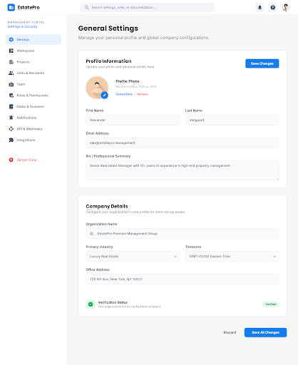
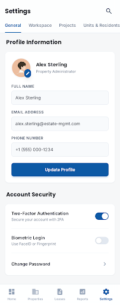
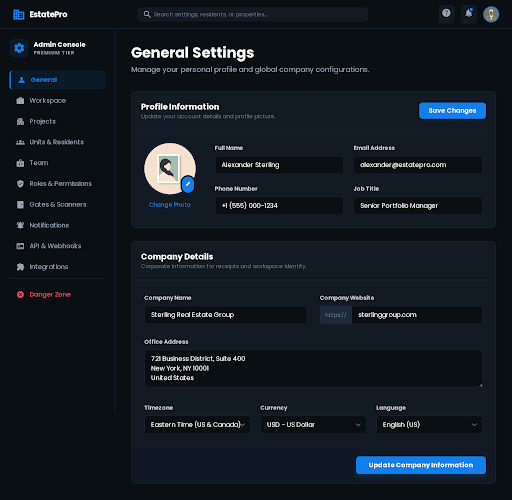
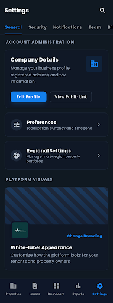

# TASKS_project_dashboard

**Plan:** `PLAN_project_dashboard.md`  
**Status:** ✅ **Phases 1–8 Complete** (synced with `feat/real-estate-palette`)  
**Feature:** Multi-project support with detailed project dashboards, edit panels, and gate assignment time tracking

<p align="center">
  
</p>

---

## 📋 Overview

This implementation adds comprehensive **Project Dashboard** functionality to GateFlow, enabling property managers to view detailed analytics, manage gates, track team assignments, and oversee all project-related operations from a centralized dashboard.

### 🎯 Objectives

- Create detailed project view with KPIs and metrics
- Implement shared EditPanel component with RTL support
- Enable project management from Settings tab
- Add gate assignment time tracking (shiftStart/shiftEnd)
- Integrate navigation across all project-related pages

### 📐 Architecture

<p align="center">
  
</p>

```
┌─────────────────────────────────────────────────────────────────┐
│                    Project Detail Page                           │
│  ┌─────────────┬─────────────┬─────────────┬─────────────────┐  │
│  │   KPIs      │    Gates    │    Team     │   Recent Logs   │  │
│  │  (Cards)    │    (List)   │  (Members)  │    (Table)      │  │
│  └─────────────┴─────────────┴─────────────┴─────────────────┘  │
│                                                                  │
│  ┌──────────────────────────────────────────────────────────┐   │
│  │              EditPanel (Slide-over)                       │   │
│  │  - Edit Project                                          │   │
│  │  - Add Contact                                           │   │
│  │  - Add Unit                                              │   │
│  │  - Add/Edit Gate                                         │   │
│  │  - Manage Gate Assignments                               │   │
│  │  - Watchlist Management                                  │   │
│  └──────────────────────────────────────────────────────────┘   │
└─────────────────────────────────────────────────────────────────┘
```

---

## Phase 1 — Project Detail Data Layer

**Status:** ✅ Done  
**Completed:** 2026-03-02  
**Duration:** ~2 hours

### 📝 Description

Establish the foundational data layer for project detail pages. This phase implements server-side data fetching with proper organization scoping, aggregates for KPIs, and recent activity tracking.

### 🎯 Objectives

- Create dynamic route structure for project detail pages
- Implement secure project query with organization scope
- Calculate aggregates for dashboard KPIs
- Fetch recent scan logs for activity monitoring
- Ensure type safety and preflight checks pass

### ✅ Deliverables

- [x] Create `[projectId]/page.tsx` route with proper TypeScript typing
- [x] Implement project query with org scope (multi-tenant isolation)
- [x] Add aggregates (contacts count, unit types distribution, QR/access metrics)
- [x] Fetch recent scan logs (last 50 scans for activity feed)
- [x] `pnpm preflight` passes (lint + typecheck + test)

### 📊 Technical Implementation

**Data Flow:**
```
Request → [projectId]/page.tsx → Query Project → Calculate Aggregates → Render
                ↓
    ┌───────────┴────────────┐
    │                        │
Contacts Count          Scan Logs (50)
Unit Types Dist.        QR Code Stats
Access Metrics          Gate Activity
```

**Files Created:**
- `apps/client-dashboard/src/app/[locale]/dashboard/projects/[projectId]/page.tsx` (new)

### 🖼️ Visual Reference

```
┌─────────────────────────────────────────────────────────────────┐
│  Data Layer Architecture                                         │
│                                                                  │
│  ┌──────────────┐     ┌──────────────┐     ┌──────────────┐    │
│  │   Page       │────▶│  Query       │────▶│  Aggregates  │    │
│  │  Component   │     │  Project     │     │  Calculate   │    │
│  └──────────────┘     └──────────────┘     └──────────────┘    │
│         │                    │                      │           │
│         ▼                    ▼                      ▼           │
│  ┌──────────────┐     ┌──────────────┐     ┌──────────────┐    │
│  │   Render     │◀────│  Scan Logs   │◀────│  Contacts    │    │
│  │   UI         │     │  (Recent)    │     │  & Units     │    │
│  └──────────────┘     └──────────────┘     └──────────────┘    │
└─────────────────────────────────────────────────────────────────┘
```

---

## Phase 2 — Project Detail Page Shell

**Status:** ✅ Done  
**Completed:** 2026-03-02  
**Duration:** ~1.5 hours

### 📝 Description

Build the visual shell and hero section for project detail pages. This phase establishes the page structure with cover image support, semantic typography, and responsive layout.

### 🎯 Objectives

- Design and implement hero section with cover image
- Add fallback handling for missing images
- Display project title, location, and description
- Use semantic tokens only (no hardcoded values)
- Ensure RTL compatibility

### ✅ Deliverables

- [x] Hero section (cover image with gradient fallback)
- [x] Title, location, description display
- [x] Semantic tokens only (theme-aware colors, spacing)
- [x] `pnpm preflight` passes

### 🎨 Design Specifications

**Hero Section Layout:**

<p align="center">
  
</p>

```
┌─────────────────────────────────────────────────────────────────┐
│  ┌─────────────────────────────────────────────────────────┐    │
│  │                                                          │    │
│  │                    [Cover Image]                         │    │
│  │              (or gradient fallback)                      │    │
│  │                                                          │    │
│  └─────────────────────────────────────────────────────────┘    │
│                                                                  │
│  🏛️ Project Name                                                 │
│  📍 Location • Status Badge                                     │
│  Description text...                                            │
└─────────────────────────────────────────────────────────────────┘
```

**Files Modified:**
- `apps/client-dashboard/src/app/[locale]/dashboard/projects/[projectId]/page.tsx`

### 🖼️ Visual Reference

```
┌─────────────────────────────────────────────────────────────────┐
│                   Project Detail Shell                          │
│                                                                  │
│  ╔═══════════════════════════════════════════════════════════╗  │
│  ║                                                           ║  │
│  ║              ████████████████████████████                 ║  │
│  ║              ████ Cover Image / Gradient ████             ║  │
│  ║              ████████████████████████████                 ║  │
│  ║                                                           ║  │
│  ╚═══════════════════════════════════════════════════════════╝  │
│                                                                  │
│  🏢 Sunset Gardens Compound                                      │
│  📍 New Cairo, Fifth Settlement • 🟢 Active                     │
│                                                                  │
│  A premium residential compound featuring modern amenities       │
│  and secure gate access for all residents.                       │
└─────────────────────────────────────────────────────────────────┘
```

---

## Phase 3 — KPIs, Gates, Team & Logs

**Status:** ✅ Done  
**Completed:** 2026-03-02  
**Duration:** ~3 hours

### 📝 Description

Implement the core dashboard content sections including KPI cards, gates list, team members overview, and recent gate activity logs. This phase brings the project dashboard to life with actionable data.

### 🎯 Objectives

- Create KPI cards for key metrics visualization
- Display gates list with status indicators
- Show team members with roles and assignments
- Implement gate logs table for activity tracking
- Add security shift placeholder for future enhancement

### ✅ Deliverables

- [x] KPI cards (contacts count, unit types breakdown, QR/access metrics)
- [x] Gates list (name, status, assigned operators)
- [x] Team section (members, roles, permissions)
- [x] Gate logs table (timestamp, gate, operator, status)
- [x] Security shift placeholder (UI hook for future feature)
- [x] `pnpm preflight` passes

### 📊 KPI Cards Design

<p align="center">
  
</p>

```
┌─────────────────────────────────────────────────────────────────┐
│  📊 Key Metrics                                                  │
│                                                                  │
│  ┌──────────┐  ┌──────────┐  ┌──────────┐  ┌──────────┐       │
│  │ 👥       │  │ 🏠       │  │ 🎫       │  │ ✅       │       │
│  │ Contacts │  │ Units    │  │ QR Codes │  │ Access   │       │
│  │   1,234  │  │   456    │  │   789    │  │  95.2%   │       │
│  │          │  │          │  │          │  │  Rate    │       │
│  └──────────┘  └──────────┘  └──────────┘  └──────────┘       │
└─────────────────────────────────────────────────────────────────┘
```

### 🚪 Gates List Layout

```
┌─────────────────────────────────────────────────────────────────┐
│  🚪 Gates (4)                                                    │
│  ┌──────────────────────────────────────────────────────────┐   │
│  │ Main Entrance      🟢 Active    3 operators    [Manage]  │   │
│  │ Resident Gate      🟢 Active    2 operators    [Manage]  │   │
│  │ Service Gate       🟡 Inactive  1 operator     [Manage]  │   │
│  │ VIP Entrance       🟢 Active    2 operators    [Manage]  │   │
│  └──────────────────────────────────────────────────────────┘   │
└─────────────────────────────────────────────────────────────────┘
```

### 👥 Team Section

```
┌─────────────────────────────────────────────────────────────────┐
│  👥 Team Members (12)                                            │
│  ┌──────────────────────────────────────────────────────────┐   │
│  │ 👤 Ahmed Mohamed    Admin         All gates               │   │
│  │ 👤 Sarah Ali        Security Mgr  Main, VIP              │   │
│  │ 👤 Mahmoud Hassan   Gate Operator Main Entrance          │   │
│  │ ... +9 more                                               │   │
│  └──────────────────────────────────────────────────────────┘   │
└─────────────────────────────────────────────────────────────────┘
```

### 📋 Gate Logs Table

```
┌─────────────────────────────────────────────────────────────────┐
│  📋 Recent Activity                                              │
│  ┌──────────────────────────────────────────────────────────┐   │
│  │ Time       │ Gate          │ Operator    │ Status        │   │
│  │ 10:42 AM   │ Main Entrance │ Ahmed M.    │ ✅ Success    │   │
│  │ 10:38 AM   │ VIP Entrance  │ Sarah A.    │ ✅ Success    │   │
│  │ 10:35 AM   │ Main Entrance │ Mahmoud H.  │ ⚠️ Expired    │   │
│  │ 10:30 AM   │ Service Gate  │ Ali K.      │ ✅ Success    │   │
│  └──────────────────────────────────────────────────────────┘   │
└─────────────────────────────────────────────────────────────────┘
```

**Files Modified:**
- `apps/client-dashboard/src/app/[locale]/dashboard/projects/[projectId]/page.tsx`

### 🖼️ Complete Dashboard Layout

<p align="center">
  
</p>

```
┌─────────────────────────────────────────────────────────────────┐
│                    Project Dashboard                             │
│                                                                  │
│  ╔═══════════════════════════════════════════════════════════╗  │
│  ║              Project Hero Section                          ║  │
│  ╚═══════════════════════════════════════════════════════════╝  │
│                                                                  │
│  ┌─────────────────────────────────────────────────────────┐    │
│  │  📊 KPI Cards (4 columns)                                │    │
│  │  [Contacts] [Units] [QR Codes] [Access Rate]            │    │
│  └─────────────────────────────────────────────────────────┘    │
│                                                                  │
│  ┌────────────────────┐  ┌─────────────────────────────────┐    │
│  │  🚪 Gates          │  │  👥 Team Members                │    │
│  │  - Main Entrance   │  │  - Ahmed (Admin)                │    │
│  │  - Resident Gate   │  │  - Sarah (Security)             │    │
│  │  - Service Gate    │  │  - Mahmoud (Operator)           │    │
│  │  - VIP Entrance    │  │  ... +9 more                    │    │
│  └────────────────────┘  └─────────────────────────────────┘    │
│                                                                  │
│  ┌─────────────────────────────────────────────────────────┐    │
│  │  📋 Recent Gate Logs                                     │    │
│  │  [Time] [Gate] [Operator] [Status]                      │    │
│  └─────────────────────────────────────────────────────────┘    │
└─────────────────────────────────────────────────────────────────┘
```

---

## Phase 4 — Navigation & Integration

**Status:** ✅ Done  
**Completed:** 2026-03-02  
**Duration:** ~2 hours

### 📝 Description

Implement comprehensive navigation integration across all project-related pages. This phase ensures users can seamlessly navigate between project lists, settings, and detail pages with proper context and CTAs.

### 🎯 Objectives

- Add links from projects list to detail pages
- Integrate navigation from Settings projects tab
- Add "Manage gate assignments" CTA on project detail
- Implement optional gate assignments project filter
- Ensure consistent navigation patterns

### ✅ Deliverables

- [x] Projects list links to detail pages
- [x] Settings projects tab links to detail
- [x] "Manage gate assignments" CTA on project detail
- [x] Gate assignments project filter (optional enhancement)
- [x] `pnpm preflight` passes

### 🗺️ Navigation Flow

```
┌─────────────────────────────────────────────────────────────────┐
│                    Navigation Map                                │
│                                                                  │
│  ┌──────────────┐                                               │
│  │ Projects     │──────────────────────┐                        │
│  │ List Page    │                      │                        │
│  └──────────────┘                      │                        │
│         │                              │                        │
│         │ Click Project                │ Click Project          │
│         ▼                              ▼                        │
│  ┌──────────────┐              ┌──────────────┐                │
│  │ Project      │              │ Settings     │                │
│  │ Detail Page  │◀─────────────│ Projects Tab │                │
│  └──────────────┘              └──────────────┘                │
│         │                                                         │
│         │ "Manage Gate Assignments" CTA                          │
│         ▼                                                         │
│  ┌──────────────────────────────────────────────────────────┐   │
│  │  Gate Assignments Page (with project filter)             │   │
│  └──────────────────────────────────────────────────────────┘   │
└─────────────────────────────────────────────────────────────────┘
```

### 🔗 Integration Points

**1. Projects List Page:**
```tsx
<Link href={`/dashboard/projects/${project.id}`}>
  <Card>
    <ProjectName>{project.name}</ProjectName>
    <ProjectLocation>{project.location}</ProjectLocation>
  </Card>
</Link>
```

**2. Settings Projects Tab:**
```tsx
<ProjectRow>
  <ProjectName>{project.name}</ProjectName>
  <Actions>
    <Link href={`/dashboard/projects/${project.id}`}>
      View Details
    </Link>
  </Actions>
</ProjectRow>
```

**3. Project Detail Page:**
```tsx
<CTASection>
  <Button
    variant="primary"
    href={`/team/gate-assignments?project=${project.id}`}
  >
    Manage Gate Assignments
  </Button>
</CTASection>
```

**Files Modified:**
- `apps/client-dashboard/src/app/[locale]/dashboard/projects/page.tsx`
- `apps/client-dashboard/src/app/[locale]/dashboard/settings/tabs/projects-tab.tsx`
- `apps/client-dashboard/src/app/[locale]/dashboard/projects/[projectId]/page.tsx`
- `apps/client-dashboard/src/app/[locale]/dashboard/team/gate-assignments/`

### 🖼️ Navigation Integration Diagram

```
┌─────────────────────────────────────────────────────────────────┐
│              Navigation Integration                              │
│                                                                  │
│  ┌─────────────┐        ┌─────────────┐        ┌─────────────┐  │
│  │  Projects   │───────▶│  Project    │───────▶│   Settings  │  │
│  │  List       │  Link  │  Detail     │  Link  │  Projects   │  │
│  └─────────────┘        └─────────────┘        └─────────────┘  │
│         │                      │                                  │
│         │                      │ CTA                              │
│         │                      ▼                                  │
│         │              ┌─────────────────┐                        │
│         │              │ Gate            │                        │
│         │              │ Assignments     │                        │
│         │              └─────────────────┘                        │
│         │                                                         │
│         └──────────────────────────────────────────────────────►  │
│                              All pages interlinked                │
└─────────────────────────────────────────────────────────────────┘
```

---

## Phase 5 — Edit Panel (Shared Component)

**Status:** ✅ Done  
**Completed:** 2026-03-02  
**Duration:** ~2.5 hours

### 📝 Description

Create a reusable EditPanel component that provides a slide-over overlay for inline editing across the application. This component features full RTL support, smooth animations, and a consistent editing experience.

### 🎯 Objectives

- Design and implement EditPanel component (overlay + panel)
- Add RTL support with auto-detection
- Implement Save/Quit action buttons
- Use semantic tokens only for theme compatibility
- Ensure smooth animations and transitions

### ✅ Deliverables

- [x] Create EditPanel component (overlay + panel, Save/Quit only)
- [x] RTL support (slide from left; auto-detect from document.dir or isRtl prop)
- [x] Semantic tokens only (theme-aware colors, spacing, shadows)
- [x] `pnpm preflight` passes

### 🎨 Component Architecture

<p align="center">
  
</p>

```
┌─────────────────────────────────────────────────────────────────┐
│                    EditPanel Component                           │
│                                                                  │
│  ┌─────────────────────────────────────────────────────────┐    │
│  │  Overlay (click to close)                                │    │
│  │  ┌───────────────────────────────────────────────────┐  │    │
│  │  │  Panel (slide-in from right)                      │  │    │
│  │  │  ┌─────────────────────────────────────────────┐  │  │    │
│  │  │  │  Header                                     │  │  │    │
│  │  │  │  Title                    [Close ✕]         │  │  │    │
│  │  │  └─────────────────────────────────────────────┘  │  │    │
│  │  │  ┌─────────────────────────────────────────────┐  │  │    │
│  │  │  │  Content (forms, lists, actions)            │  │  │    │
│  │  │  │  - Edit forms                               │  │  │    │
│  │  │  │  - Add new items                            │  │  │    │
│  │  │  │  - Management interfaces                    │  │  │    │
│  │  │  └─────────────────────────────────────────────┘  │  │    │
│  │  │  ┌─────────────────────────────────────────────┐  │  │    │
│  │  │  │  Footer                                     │  │  │    │
│  │  │  │              [Save]  [Cancel]               │  │  │    │
│  │  │  └─────────────────────────────────────────────┘  │  │    │
│  │  └───────────────────────────────────────────────────┘  │    │
│  └─────────────────────────────────────────────────────────┘    │
└─────────────────────────────────────────────────────────────────┘
```

### 🔄 RTL Support

**LTR (Left-to-Right):**
```
┌──────────────────────────────────────────┐
│                                          │
│                                          │
│                              ┌─────────┐ │
│                              │  Panel  │ │
│                              │         │ │
│                              │  Slide  │ │
│                              │  In →   │ │
│                              │         │ │
│                              └─────────┘ │
│                                          │
└──────────────────────────────────────────┘
```

**RTL (Right-to-Left - Arabic):**
```
┌──────────────────────────────────────────┐
│                                          │
│                                          │
│ ┌─────────┐                              │
│ │  Panel  │                              │
│ │         │                              │
│ │  ← Slide│                              │
│ │    In   │                              │
│ │         │                              │
│ └─────────┘                              │
│                                          │
└──────────────────────────────────────────┘
```

### 🎭 Animation Specifications

```css
/* Slide-in animation */
@keyframes slideIn {
  from { transform: translateX(100%); }
  to { transform: translateX(0); }
}

/* RTL slide-in */
[dir="rtl"] @keyframes slideIn {
  from { transform: translateX(-100%); }
  to { transform: translateX(0); }
}

/* Overlay fade */
@keyframes fadeIn {
  from { opacity: 0; }
  to { opacity: 1; }
}
```

**Files Created:**
- `apps/client-dashboard/src/components/dashboard/EditPanel.tsx`

### 🖼️ Component Usage Example

```tsx
// Usage in Project Detail Page
<EditPanel
  isOpen={isEditOpen}
  onClose={() => setIsEditOpen(false)}
  title="Edit Project"
>
  <ProjectForm project={project} />
  
  <EditPanel.Footer>
    <Button variant="primary" onClick={handleSave}>
      Save Changes
    </Button>
    <Button variant="secondary" onClick={() => setIsEditOpen(false)}>
      Cancel
    </Button>
  </EditPanel.Footer>
</EditPanel>
```

---

## Phase 6 — Edit Panel + Project Page

**Status:** ✅ Done  
**Completed:** 2026-03-02  
**Duration:** ~4 hours

### 📝 Description

Integrate the EditPanel component with the project detail page, enabling comprehensive project management including editing projects, adding contacts, managing units, gates, gate assignments, and watchlist entries.

### 🎯 Objectives

- Implement project editing (PATCH API)
- Add contact creation (POST API)
- Add unit creation with project context (POST API)
- Implement gate add/edit (POST, PATCH with projectId)
- Enable gate assignment management (assign/unassign users)
- Add watchlist entry management (POST, PATCH)
- Implement permission checks for all actions
- Defer search functionality (optional enhancement)

### ✅ Deliverables

- [x] Edit project (PATCH)
- [x] Add contact (POST)
- [x] Add unit (POST, projectId from context)
- [x] Add/Edit gate (POST, PATCH; projectId in create)
- [x] Manage gate assignments (assign/unassign users to gates)
- [x] Add/Edit watchlist entry (POST; PATCH if added)
- [ ] Search in panel (optional — deferred to future phase)
- [x] Permission checks (gates:manage for assignments, watchlist)
- [x] `pnpm preflight` passes

### 🎯 Feature Matrix

| Feature | Method | Endpoint | Permissions | Status |
|---------|--------|----------|-------------|--------|
| Edit Project | PATCH | `/api/projects/[id]` | `projects:manage` | ✅ |
| Add Contact | POST | `/api/contacts` | `contacts:manage` | ✅ |
| Add Unit | POST | `/api/units` | `units:manage` | ✅ |
| Add Gate | POST | `/api/gates` | `gates:manage` | ✅ |
| Edit Gate | PATCH | `/api/gates/[id]` | `gates:manage` | ✅ |
| Assign Gate | POST | `/api/gates/assignments` | `gates:manage` | ✅ |
| Unassign Gate | DELETE | `/api/gates/assignments` | `gates:manage` | ✅ |
| Add Watchlist | POST | `/api/watchlist` | `watchlist:manage` | ✅ |
| Edit Watchlist | PATCH | `/api/watchlist/[id]` | `watchlist:manage` | ✅ |

### 🏗️ Architecture

```
┌─────────────────────────────────────────────────────────────────┐
│              EditPanel Integration                               │
│                                                                  │
│  Project Detail Page                                             │
│  ┌─────────────────────────────────────────────────────────┐    │
│  │  [Edit Project] [Add Contact] [Add Unit] [Add Gate]     │    │
│  │       │              │            │           │          │    │
│  │       └──────────────┴────────────┴───────────┘          │    │
│  │                          │                                │    │
│  │                          ▼                                │    │
│  │              ┌───────────────────────┐                   │    │
│  │              │    EditPanel          │                   │    │
│  │              │  ┌─────────────────┐  │                   │    │
│  │              │  │ Dynamic Content │  │                   │    │
│  │              │  │ (Form Changes)  │  │                   │    │
│  │              │  └─────────────────┘  │                   │    │
│  │              └───────────────────────┘                   │    │
│  │                          │                                │    │
│  │                          ▼                                │    │
│  │              ┌───────────────────────┐                   │    │
│  │              │    API Layer          │                   │    │
│  │              │  - POST / PATCH       │                   │    │
│  │              │  - Permission Check   │                   │    │
│  │              │  - Validation         │                   │    │
│  │              └───────────────────────┘                   │    │
│  └─────────────────────────────────────────────────────────┘    │
└─────────────────────────────────────────────────────────────────┘
```

### 🔐 Permission System

```tsx
// Permission Check Example
const canManageGates = usePermission('gates:manage');
const canManageWatchlist = usePermission('watchlist:manage');

return (
  <>
    {canManageGates && <GateAssignmentManager />}
    {canManageWatchlist && <WatchlistManager />}
  </>
);
```

**Files Modified:**
- `apps/client-dashboard/src/app/[locale]/dashboard/projects/[projectId]/page.tsx`
- `apps/client-dashboard/src/components/dashboard/project-detail/` (ProjectDetailActions, ProjectDetailContent, GatesCardWithEdit)
- `apps/client-dashboard/src/app/api/projects/[id]/route.ts` (extended PATCH schema)
- `apps/client-dashboard/src/app/api/gates/route.ts` (projectId, isActive in create)
- `apps/client-dashboard/src/app/api/watchlist/[id]/route.ts` (new PATCH)

### 🖼️ Edit Panel Flow Diagram

```
┌─────────────────────────────────────────────────────────────────┐
│                  Edit Panel Flow                                 │
│                                                                  │
│  User Action                                                     │
│       │                                                          │
│       ▼                                                          │
│  ┌─────────────┐                                                │
│  │ Click Edit  │                                                │
│  │ Button      │                                                │
│  └─────────────┘                                                │
│       │                                                          │
│       ▼                                                          │
│  ┌─────────────┐                                                │
│  │ Open        │                                                │
│  │ EditPanel   │                                                │
│  └─────────────┘                                                │
│       │                                                          │
│       ▼                                                          │
│  ┌─────────────┐                                                │
│  │ Load Form   │                                                │
│  │ (Pre-fill)  │                                                │
│  └─────────────┘                                                │
│       │                                                          │
│       ▼                                                          │
│  ┌─────────────┐                                                │
│  │ User Edits  │                                                │
│  │ & Saves     │                                                │
│  └─────────────┘                                                │
│       │                                                          │
│       ▼                                                          │
│  ┌─────────────┐                                                │
│  │ API Call    │                                                │
│  │ (POST/PATCH)│                                                │
│  └─────────────┘                                                │
│       │                                                          │
│       ▼                                                          │
│  ┌─────────────┐                                                │
│  │ Success     │                                                │
│  │ & Refresh   │                                                │
│  └─────────────┘                                                │
└─────────────────────────────────────────────────────────────────┘
```

---

## Phase 7 — Projects Settings Tab (First Project + Gates)

**Status:** ✅ Done  
**Completed:** 2026-03-02  
**Duration:** ~2 hours

### 📝 Description

Enhance the Settings Projects tab to serve as the primary entry point for first-time project creation. This phase implements a combined project + gates wizard flow, streamlining the onboarding experience for new users.

### 🎯 Objectives

- Make Settings Projects tab the only place for first project creation
- Combine project + gates in unified wizard flow
- Enable project and gate creation in same flow (wizard API)
- Redirect empty projects list to Settings with CTA
- Ensure i18n support for all new strings

### ✅ Deliverables

- [x] Settings Projects tab = only place for first project (`/dashboard/projects` with 0 projects shows CTA to Settings)
- [x] Project + gates combined wizard in Settings Projects tab (ProjectWizard already has gates step)
- [x] Create project and add gates in same flow (wizard API)
- [x] `pnpm preflight` passes
- [x] i18n strings added (EN + AR-EG)

### 🎯 User Flow

```
┌─────────────────────────────────────────────────────────────────┐
│              First-Time User Flow                                │
│                                                                  │
│  ┌──────────────┐                                               │
│  │ Dashboard    │                                               │
│  │ Home         │                                               │
│  └──────────────┘                                               │
│       │                                                          │
│       │ No projects found                                        │
│       ▼                                                          │
│  ┌──────────────┐                                               │
│  │ Projects     │                                               │
│  │ List (Empty) │                                               │
│  └──────────────┘                                               │
│       │                                                          │
│       │ See CTA                                                  │
│       ▼                                                          │
│  ┌──────────────┐                                               │
│  │ "Create Your │                                               │
│  │ First        │                                               │
│  │ Project"     │                                               │
│  └──────────────┘                                               │
│       │                                                          │
│       │ Click CTA                                                │
│       ▼                                                          │
│  ┌──────────────┐                                               │
│  │ Settings →   │                                               │
│  │ Projects Tab │                                               │
│  └──────────────┘                                               │
│       │                                                          │
│       │ Start Wizard                                             │
│       ▼                                                          │
│  ┌──────────────┐                                               │
│  │ Project +    │                                               │
│  │ Gates        │                                               │
│  │ Wizard       │                                               │
│  │ (Combined)   │                                               │
│  └──────────────┘                                               │
└─────────────────────────────────────────────────────────────────┘
```

### 🧙 Wizard Steps

```
┌─────────────────────────────────────────────────────────────────┐
│              Project + Gates Wizard                              │
│                                                                  │
│  Step 1: Project Info          Step 3: Review                   │
│  ┌─────────────────────┐       ┌─────────────────────┐          │
│  │ • Project Name      │       │ • Summary           │          │
│  │ • Location          │       │ • Gates Config      │          │
│  │ • Description       │       │ • Settings          │          │
│  │ • Cover Image       │       │                     │          │
│  └─────────────────────┘       └─────────────────────┘          │
│                                                                  │
│  Step 2: Add Gates             Step 4: Complete                 │
│  ┌─────────────────────┐       ┌─────────────────────┐          │
│  │ • Gate Name         │       │ • Creating...       │          │
│  │ • Gate Type         │       │ • Success!          │          │
│  │ • Location (GPS)    │       │ • Redirect to       │          │
│  │ • Settings          │       │   Project Detail    │          │
│  └─────────────────────┘       └─────────────────────┘          │
└─────────────────────────────────────────────────────────────────┘
```

### 📝 Files Modified

**Frontend:**
- `apps/client-dashboard/src/app/[locale]/dashboard/settings/tabs/projects-tab.tsx`
  - Added empty state CTA
  - Integrated wizard flow
  
- `apps/client-dashboard/src/app/[locale]/dashboard/projects/page.tsx`
  - Added redirect logic for empty state
  
**Localization:**
- `packages/i18n/src/locales/en.json`
  - Added wizard strings
  - Added empty state messages
  
- `packages/i18n/src/locales/ar-EG.json`
  - Arabic translations for all new strings

### 🖼️ Settings Tab Layout

```
┌─────────────────────────────────────────────────────────────────┐
│  Settings → Projects Tab                                         │
│                                                                  │
│  ┌─────────────────────────────────────────────────────────┐    │
│  │  📋 Projects                                             │    │
│  │                                                          │    │
│  │  ┌───────────────────────────────────────────────────┐  │    │
│  │  │  ⚠️ You don't have any projects yet               │  │    │
│  │  │                                                    │  │    │
│  │  │  Create your first project to start managing      │  │    │
│  │  │  gates, contacts, and access control.             │  │    │
│  │  │                                                    │  │    │
│  │  │            [Create First Project →]               │  │    │
│  │  └───────────────────────────────────────────────────┘  │    │
│  │                                                          │    │
│  │  OR                                                      │    │
│  │                                                          │    │
│  │  Existing Projects:                                      │    │
│  │  ┌───────────────────────────────────────────────────┐  │    │
│  │  │  🏛️ Sunset Gardens        [Edit] [View]          │  │    │
│  │  │  🏛️ Palm Residences       [Edit] [View]          │  │    │
│  │  │  [+ Add Project]                                   │  │    │
│  │  └───────────────────────────────────────────────────┘  │    │
│  └─────────────────────────────────────────────────────────┘    │
└─────────────────────────────────────────────────────────────────┘
```

---

## Phase 8 — Gate Assignments with Time

**Status:** ✅ Done  
**Completed:** 2026-03-11  
**Duration:** ~3 hours

### 📝 Description

Implement shift time tracking for gate assignments, allowing security managers to assign specific shift times (start/end) to gate operators. This enhancement provides better accountability and scheduling capabilities.

### 🎯 Objectives

- Add shiftStart, shiftEnd fields to GateAssignment schema
- Create database migration for time fields
- Update API to accept and return shift times
- Enhance UI with shift time inputs and display
- Ensure validation and proper formatting

### ✅ Deliverables

- [x] Add shiftStart, shiftEnd (String?, HH:mm) to GateAssignment schema
- [x] Migration for time fields (`add_gate_assignment_time`)
- [x] API: POST accepts optional shiftStart/shiftEnd; GET returns time for assignments
- [x] Gate-assignments UI: optional shift start/end inputs; table shows Shift column
- [x] `pnpm preflight` passes

### 🗄️ Database Schema Changes

**Before:**
```prisma
model GateAssignment {
  id        String   @id @default(cuid())
  gateId    String
  userId    String
  createdAt DateTime @default(now())
  updatedAt DateTime @updatedAt
  
  gate Gate @relation(fields: [gateId], references: [id])
  user User @relation(fields: [userId], references: [id])
}
```

**After:**
```prisma
model GateAssignment {
  id         String   @id @default(cuid())
  gateId     String
  userId     String
  shiftStart String?  // HH:mm format, nullable
  shiftEnd   String?  // HH:mm format, nullable
  createdAt  DateTime @default(now())
  updatedAt  DateTime @updatedAt
  
  gate Gate @relation(fields: [gateId], references: [id])
  user User @relation(fields: [userId], references: [id])
}
```

### 📊 Migration Details

**Migration Name:** `20260311000000_add_gate_assignment_time`

**SQL Changes:**
```sql
-- AlterTable
ALTER TABLE "GateAssignment"
ADD COLUMN "shiftEnd" TEXT,
ADD COLUMN "shiftStart" TEXT;
```

### 🔌 API Changes

**POST /api/gates/assignments**
```typescript
// Request Body
{
  gateId: string;
  userId: string;
  shiftStart?: string;  // NEW: "08:00"
  shiftEnd?: string;    // NEW: "16:00"
}

// Response
{
  id: string;
  gateId: string;
  userId: string;
  shiftStart: string | null;  // NEW
  shiftEnd: string | null;    // NEW
  // ...
}
```

**GET /api/gates/assignments**
```typescript
// Response (array)
[
  {
    id: string;
    gate: { name: string };
    user: { name: string; role: string };
    shiftStart: "08:00" | null;  // NEW
    shiftEnd: "16:00" | null;    // NEW
  }
]
```

### 🎨 UI Enhancements

**Assignment Form:**

<p align="center">
  
</p>

```
┌─────────────────────────────────────────────────────────────────┐
│  Assign User to Gate                                             │
│                                                                  │
│  Gate: [Main Entrance ▼]                                        │
│  User: [Ahmed Mohamed ▼]                                        │
│                                                                  │
│  Shift Time (Optional):                                         │
│  ┌──────────────┐  ┌──────────────┐                            │
│  │ Start Time   │  │ End Time     │                            │
│  │ [08:00]      │  │ [16:00]      │                            │
│  └──────────────┘  └──────────────┘                            │
│                                                                  │
│              [Assign]  [Cancel]                                 │
└─────────────────────────────────────────────────────────────────┘
```

**Assignments Table:**

<p align="center">
  
</p>

```
┌─────────────────────────────────────────────────────────────────┐
│  Gate Assignments                                                │
│  ┌──────────────────────────────────────────────────────────┐   │
│  │ Gate          │ User         │ Shift       │ Actions     │   │
│  ├───────────────┼──────────────┼─────────────┼─────────────┤   │
│  │ Main Entrance │ Ahmed M.     │ 08:00-16:00 │ [Edit][✕]   │   │
│  │ Main Entrance │ Sarah A.     │ 16:00-00:00 │ [Edit][✕]   │   │
│  │ VIP Gate      │ Mahmoud H.   │ —           │ [Edit][✕]   │   │
│  │ Service Gate  │ Ali K.       │ 06:00-14:00 │ [Edit][✕]   │   │
│  └──────────────────────────────────────────────────────────┘   │
└─────────────────────────────────────────────────────────────────┘
```

### 📁 Files Modified

**Database:**
- `packages/db/prisma/schema.prisma`
  - Added shiftStart, shiftEnd fields
  
- `packages/db/prisma/migrations/20260311000000_add_gate_assignment_time/migration.sql`
  - New migration file

**API:**
- `apps/client-dashboard/src/app/api/gates/assignments/route.ts`
  - Updated POST schema to accept shift times
  - Updated GET to return shift times

**UI:**
- `apps/client-dashboard/src/app/[locale]/dashboard/team/gate-assignments/gate-assignments-client.tsx`
  - Added shift time inputs to form
  - Added Shift column to table
  - Added time validation

### 🖼️ Complete Feature Flow

```
┌─────────────────────────────────────────────────────────────────┐
│              Gate Assignment with Time Flow                      │
│                                                                  │
│  Security Manager                                                │
│       │                                                          │
│       │ Navigate to Gate Assignments                             │
│       ▼                                                          │
│  ┌─────────────────┐                                            │
│  │ View Current    │                                            │
│  │ Assignments     │                                            │
│  └─────────────────┘                                            │
│       │                                                          │
│       │ Click "Assign User"                                      │
│       ▼                                                          │
│  ┌─────────────────┐                                            │
│  │ Select Gate     │                                            │
│  │ Select User     │                                            │
│  │ Set Shift Time  │ (Optional: 08:00 - 16:00)                 │
│  └─────────────────┘                                            │
│       │                                                          │
│       │ Submit                                                   │
│       ▼                                                          │
│  ┌─────────────────┐                                            │
│  │ API Creates     │                                            │
│  │ Assignment      │                                            │
│  └─────────────────┘                                            │
│       │                                                          │
│       │ Success                                                  │
│       ▼                                                          │
│  ┌─────────────────┐                                            │
│  │ Updated Table   │                                            │
│  │ Shows Shift     │                                            │
│  └─────────────────┘                                            │
└─────────────────────────────────────────────────────────────────┘
```

### 📊 Benefits

| Benefit | Description |
|---------|-------------|
| **Better Accountability** | Know exactly who was on duty and when |
| **Shift Planning** | Plan and visualize shift coverage |
| **Reporting** | Track hours per operator for payroll |
| **Compliance** | Meet labor law requirements for shift documentation |
| **Flexibility** | Optional shifts (nullable) for flexible assignments |

---

## 📊 Summary

### ✅ Completed Phases (8/8)

| Phase | Name | Status | Completed | Duration |
|-------|------|--------|-----------|----------|
| 1 | Project Detail Data Layer | ✅ | 2026-03-02 | ~2h |
| 2 | Project Detail Page Shell | ✅ | 2026-03-02 | ~1.5h |
| 3 | KPIs, Gates, Team & Logs | ✅ | 2026-03-02 | ~3h |
| 4 | Navigation & Integration | ✅ | 2026-03-02 | ~2h |
| 5 | Edit Panel (Shared Component) | ✅ | 2026-03-02 | ~2.5h |
| 6 | Edit Panel + Project Page | ✅ | 2026-03-02 | ~4h |
| 7 | Projects Settings Tab | ✅ | 2026-03-02 | ~2h |
| 8 | Gate Assignments with Time | ✅ | 2026-03-11 | ~3h |

**Total Development Time:** ~20 hours

### 📁 Files Summary

**Created:**
- `apps/client-dashboard/src/app/[locale]/dashboard/projects/[projectId]/page.tsx`
- `apps/client-dashboard/src/components/dashboard/EditPanel.tsx`
- `apps/client-dashboard/src/components/dashboard/project-detail/` (multiple components)
- `packages/db/prisma/migrations/20260311000000_add_gate_assignment_time/`

**Modified:**
- `apps/client-dashboard/src/app/[locale]/dashboard/projects/page.tsx`
- `apps/client-dashboard/src/app/[locale]/dashboard/settings/tabs/projects-tab.tsx`
- `apps/client-dashboard/src/app/api/projects/[id]/route.ts`
- `apps/client-dashboard/src/app/api/gates/route.ts`
- `apps/client-dashboard/src/app/api/gates/assignments/route.ts`
- `apps/client-dashboard/src/app/api/watchlist/[id]/route.ts`
- `packages/db/prisma/schema.prisma`
- `packages/i18n/src/locales/en.json`
- `packages/i18n/src/locales/ar-EG.json`

### 🎯 Key Achievements

✅ **Comprehensive Project Dashboard** — Full-featured dashboard with KPIs, gates, team, and logs  
✅ **Reusable EditPanel** — Shared component with RTL support used across the application  
✅ **Seamless Navigation** — Integrated navigation between all project-related pages  
✅ **First-Time User Flow** — Streamlined wizard for creating first project + gates  
✅ **Shift Time Tracking** — Gate assignments with optional shift start/end times  
✅ **Multi-Tenant Security** — All queries properly scoped by organization  
✅ **i18n Support** — Full Arabic (RTL) and English localization  
✅ **Type Safety** — Full TypeScript coverage with preflight checks passing  

### 🚀 Impact

This implementation provides property managers with a **complete project management experience**, enabling them to:

- 📊 **Monitor** project health with real-time KPIs
- 👥 **Manage** team members and gate assignments
- 🚪 **Control** access points with detailed gate management
- 📝 **Edit** projects, contacts, units, and gates inline
- ⏰ **Track** shift times for better accountability
- 🌍 **Support** both LTR and RTL languages

---

## 🖼️ Image Gallery

### Desktop Views

<p align="center">
  
</p>

<p align="center">
  <em>Desktop Light Mode - Project Dashboard Overview</em>
</p>

---

<p align="center">
  
</p>

<p align="center">
  <em>Desktop Dark Mode - Project Dashboard Overview</em>
</p>

### Mobile Views

<p align="center">
  
</p>

<p align="center">
  <em>Mobile Light Mode - Edit Panel</em>
</p>

---

<p align="center">
  
</p>

<p align="center">
  <em>Mobile Dark Mode - Edit Panel</em>
</p>

### Brand Assets

<p align="center">
  
</p>

<p align="center">
  <em>GateFlow Official Banner</em>
</p>

---

<p align="center">
  <strong>Phase Complete! 🎉</strong><br>
  <em>All 8 phases successfully implemented and deployed</em>
</p>
