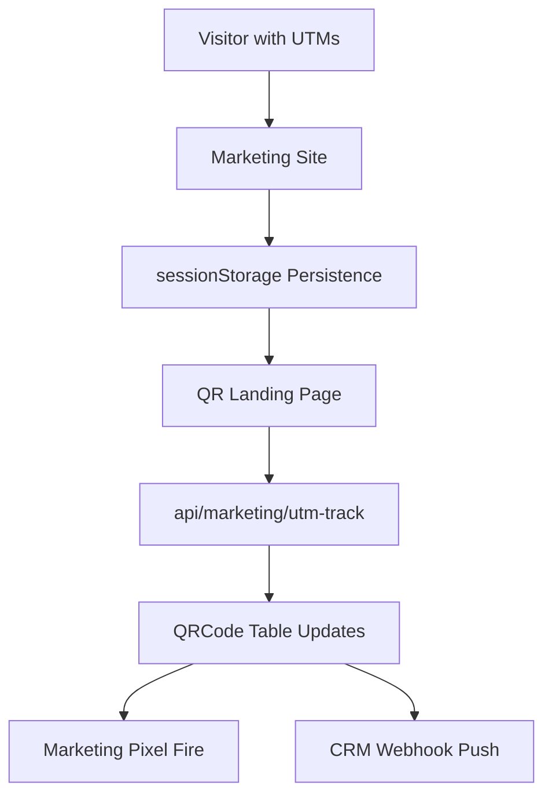

# <p align="center">Marketing Suite — Physical Attribution Operative</p>

<p align="center">
  
  
</p>

---

## 📋 Overview

The GateFlow Marketing Suite provides unprecedented transparency into physical real-estate traffic. It transforms traditional gate access into a digital attribution node, enabling developers to map physical arrivals directly back to marketing spend.

> [!IMPORTANT]
> **Digital-to-Physical Bridge**: Physical visits are tracked with the same precision as website clicks, using Meta Pixels, GA4 Event Streams, and UTM Persistence.

---

## 🎯 Core Features

### 1. Meta Pixel Integration 

- **Automatic Initialization**: Async script loading across the marketing ecosystem.
- **Event Firing**: Automatic `PageView`, `QRScan`, and `Lead` tracking.
- **Config**: Managed via `NEXT_PUBLIC_META_PIXEL_ID`.

### 2. Google Analytics 4 (GA4) 

- **Attribute Streams**: Custom `qr_scan` and `generate_lead` events with full param depth.
- **Measurement**: Configured via `NEXT_PUBLIC_GA4_MEASUREMENT_ID`.

### 3. UTM Parameter Persistence 

- **Session Bridge**: Extracts and persists UTM params (`source`, `medium`, `campaign`, etc.) across the resident registration funnel.
- **Attribution Storage**: Writes source data directly to the `QRCode` record upon generation.

### 4. CRM Webhook Architecture 

- **Real-time Sync**: Pushes `contact.created`, `qr.scanned`, and `visitor.arrived` events to external CRMs (HubSpot, Salesforce, etc.).
- **Security**: Mandatory HMAC-SHA256 signing for all outgoing payloads.

---

## 🏗️ Technical Architecture



---

## 🔧 Configuration Quickstart

### Marketing Site (`.env.local`)

```bash
NEXT_PUBLIC_META_PIXEL_ID=your_id
NEXT_PUBLIC_GA4_MEASUREMENT_ID=G-XXXXX
```

### Dashboard Setup

1. Navigate to **Settings → Integrations**.
2. Input Pixel IDs and Webhook endpoint URLs.
3. Save and verify signature secrets.

---

<div align="center">
  <sub>Managed by the <b>Ralph Loop</b> Autonomous Engineering Stack.</sub>
</div>
