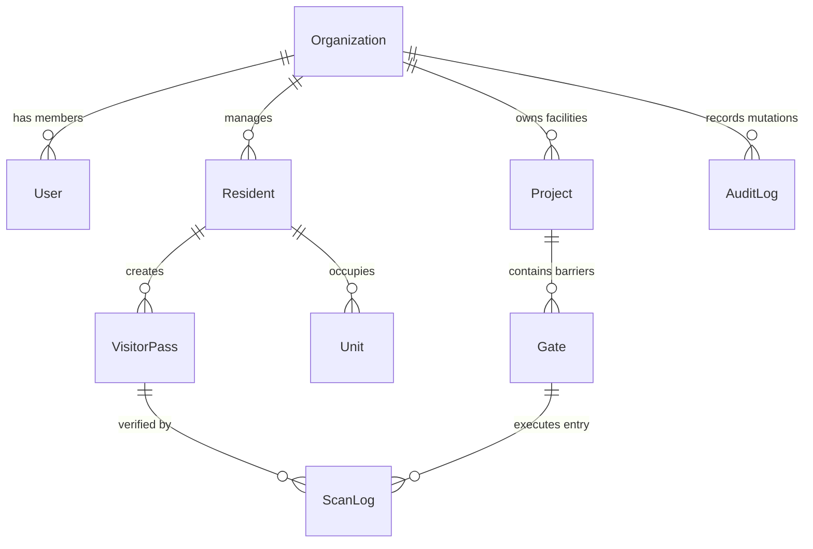

# GateFlow Master AI Knowledge Base & Context Engine

> **Document Type**: Comprehensive Monorepo & System Knowledge Base  
> **Target Audience**: External AI Engines (Grok, NotebookLM, Claude, ChatGPT, Gemini), Senior Staff Engineers, Security Auditors  
> **Repository**: `iDorgham/Gateflow` (Gate-Access Monorepo)  
> **Workspace Version**: 0.5.1  
> **Last Updated**: August 27, 2026

---

## 1. Executive Summary & Business Mission

**GateFlow** is an enterprise-grade physical security automation and gated-community management SaaS platform engineered specifically for the MENA region (Egypt, Saudi Arabia, UAE, Qatar) and global smart facilities.

### Core Value Proposition

1. **Frictionless Cryptographic Access**: Replaces manual guard logbooks with instant, signed, anti-replay HMAC-SHA256 QR visitor passes that open physical barriers in <120ms.
2. **Offline-First Hardware Resilience**: Gate barriers and scanner devices operate autonomously during internet outages using local cryptographic keyrings and SQLite event buffering.
3. **Enterprise Multi-Tenancy**: Zero-trust multi-tenancy with strict organizational scoping, role-based access control (Owner, Admin, Guard, Resident, Concierge), and complete data isolation.
4. **MENA-Native UX & Compliance**: Full bidirectional Arabic RTL layout, Egyptian Arabic conversational copywriting, and strict adherence to Egyptian Law 151 (PDPL) and Saudi Data Protection regulations (AES-256-GCM encrypted PII).

---

## 2. Monorepo Architecture & Directory Topology

GateFlow is structured as a high-performance **pnpm + Turborepo** monorepo:

```
Gate-Access/
├── apps/
│   ├── marketing/           # Public landing, pricing, SEO, lead capture (Next.js 14, Port 3000)
│   ├── client-dashboard/    # Facility management, QR studio, GateAI concierge (Next.js 14, Port 3001)
│   ├── admin-dashboard/     # SuperAdmin tenant governance, billing, telemetry (Next.js 14, Port 3002)
│   ├── resident-portal/     # Resident PWA for visitor pass creation & tracking (Next.js 14, Port 3003)
│   ├── design-system/       # Interactive ADS component showcase & Storybook (Next.js 14, Port 3004)
│   ├── scanner-app/         # Security guard native barrier controller (Expo SDK 54, React Native)
│   └── resident-mobile/     # Resident native key & community app (Expo SDK 54, React Native)
│
├── packages/
│   ├── db/                  # Prisma schema, PostgreSQL migrations, client singleton
│   ├── theme/               # @gateflow/theme: ADS tokens, next-themes, cookie sync
│   ├── i18n/                # @gate-access/i18n: Shared Arabic/English locale cookie helpers
│   ├── ui/                  # @gate-access/ui: Shared component primitives & native tokens
│   ├── security/            # @gate-access/security: AES-256-GCM, HMAC-SHA256, Audit ledger
│   ├── config/              # Shared ESLint, Prettier, TypeScript, Tailwind presets
│   └── types/               # Shared domain interfaces and API payload types
│
├── docs/                    # Architecture, PRDs, audits, planning backlog, references
├── scripts/                 # AI synchronization, preflight checks, CI automation, db migrate
└── .github/workflows/       # Automated CI/CD (deploy.yml, ci.yml, security-scan.yml)
```

---

## 3. Database Schema & Domain Model Dictionary

The database tier is powered by **PostgreSQL** via **Prisma 5.x**. Key entities include:



### Core Entities & Invariants

- **`Organization`**: Tenant root boundary. Contains name, slug, billing tier (`FREE`, `STARTER`, `PRO`, `ENTERPRISE`), and security settings.
- **`User`**: Authenticated dashboard user with email, hashed password (bcrypt), role (`SUPERADMIN`, `ORG_OWNER`, `ORG_ADMIN`, `GUARD`, `CONCIERGE`), and MFA status.
- **`Project`**: Physical compound, gated community, or commercial facility belonging to an Organization.
- **`Gate`**: Physical entrance/exit lane associated with a hardware barrier controller, IP/serial relay switch, and scanner device.
- **`Resident`**: Property occupant linked to specific `Unit`(s) and authorized to generate visitor QR passes.
- **`VisitorPass`**: Time-bounded cryptographic invitation containing guest name, phone, vehicle plate, expiration timestamp, dynamic nonce, and HMAC-SHA256 signature.
- **`ScanLog`**: Immutable access record storing scan timestamp, gate ID, outcome (`GRANTED`, `DENIED_EXPIRED`, `DENIED_NONCE_REPLAY`, `DENIED_INVALID_SIGNATURE`), and guard ID.
- **`AuditLog`**: Cryptographically chained ledger (SHA-256 previous hash link) capturing all administrative mutations.

---

## 4. Cryptographic Security & Hardware Barrier Protocols

### 4.1. HMAC-SHA256 QR Code Architecture

1. **Generation**: The dashboard/portal creates a signed payload:
   ```json
   {
     "qrId": "clx...",
     "orgId": "org_123",
     "projId": "proj_456",
     "exp": 1787800000,
     "nonce": "a1b2c3d4e5f6",
     "sig": "e3b0c44298fc1c149afbf4c8996fb92427ae41e4649b934ca495991b7852b855"
   }
   ```
2. **Deterministic DB ID Binding**: The DB identifier (`qrId`) must be encoded inside the signed payload.
3. **Verification**: The scanner checks:
   - `now() < exp` (Pass has not expired).
   - `HMAC_SHA256(payload_body, secret) === sig` (Signature matches).
   - `nonce` has not been seen in the sliding anti-replay cache within the valid window.
4. **Relay Command**: Once verified, the scanner transmits a CCITT-CRC16 framed command packet to the barrier relay over TCP/RS-485 to trigger gate opening.

### 4.2. PII Encryption at Rest

- Sensitive resident and visitor data (National ID numbers, phone numbers, vehicle registration numbers) are encrypted at rest using **AES-256-GCM** with per-tenant envelope encryption keys.

---

## 5. Design System (ADS) & Arabic RTL Localization

### 5.1. Token Architecture (`@gateflow/theme`)

- Built on Atlassian Design System (ADS) token semantics.
- Tokens are exported as CSS variables (e.g., `var(--ds-background-default)`, `var(--ds-text-primary)`).
- Hydration-safe theme switching (Light / Dark / System) with synchronous cookie persistence (`gateflow-theme`).

### 5.2. Localization & Bidirectional Layout (`@gate-access/i18n`)

- Shared locale cookie `gf_locale` is set on `Domain=.gateflow.site` in production.
- Changing language in `marketing` automatically sets language for `client-dashboard`, `admin-dashboard`, and `resident-portal`.
- Full RTL support with Cairo Arabic typography, mirrored icons, and logical CSS spacing (`ms-*`, `me-*`, `ps-*`, `pe-*`).

---

## 6. Golden Rules & AI Coding Directives

When writing code or solving problems in GateFlow, **ALWAYS** adhere to these mandates:

1. **Multi-Tenancy Isolation**:
   - Every database query MUST filter by `organizationId`.
   - Never write unscoped queries on tenant models.
2. **Soft Delete Awareness**:
   - Filter `deletedAt: null` only on models that define the `deletedAt` field (e.g., `User`, `Resident`, `VisitorPass`).
   - Do NOT add `deletedAt` to log models (`ScanLog`, `AuditLog`, `BlogPost`).
3. **Database URL Conventions**:
   - Runtime application queries use pooled connection strings (`DATABASE_URL`).
   - Prisma CLI migrations and direct schema operations MUST use `DIRECT_DATABASE_URL`.
4. **PWA & Service Worker Safety**:
   - Service workers must prioritize network-first navigation with graceful fallbacks. Never return `undefined` from `event.respondWith()`.
5. **No Blind `git add .`**:
   - Always commit focused, explicit slices of files. Never commit lockfile noise or generated caches.
6. **Package Manager**:
   - Exclusively use `pnpm`. Never invoke `npm` or `yarn`.

---

## 7. Useful Operational Commands

- **Full Monorepo Preflight**: `pnpm preflight` (Runs lint, typecheck, tests, changelog check across all 19 workspaces).
- **Package Tests**: `pnpm --filter <package-name> test` (e.g., `pnpm --filter @gateflow/theme test`).
- **Database Migration**: `pnpm --filter @gate-access/db prisma migrate dev`.
- **Vercel Deploy**: `gh workflow run deploy.yml --ref master -f app=all` (Manual dispatch only).

---

## 8. Summary for LLMs (Grok / NotebookLM Quick Prompt)

> **"GateFlow is an enterprise physical security SaaS monorepo built with Next.js 14, Expo SDK 54, Prisma PostgreSQL, Tailwind, and ADS design tokens. It provides HMAC-SHA256 QR visitor access, offline hardware barrier automation, and Arabic RTL multi-tenancy for the MENA region. All queries require `organizationId` scoping. All deployments are triggered manually via GitHub Actions."**
