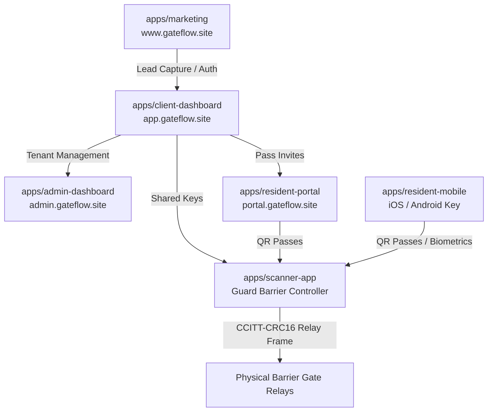

# GateFlow — Master Product Requirements Document (PRD)

> **Document Version:** 13.0 (Master Enterprise & Pilot Certification Edition)  
> **Status:** Active / Production Ready  
> **Last Updated:** 2026-08-27  
> **Target Domain:** `*.gateflow.site`  
> **Confidentiality:** Internal Engineering, Product, Security & Operations

---

## 1. Executive Summary

**GateFlow** is an enterprise-grade multi-tenant physical access control, security automation, and resident operations platform engineered for gated communities, residential compounds, and commercial real estate hubs in the MENA region (Egypt, Saudi Arabia, UAE) and globally.

GateFlow unifies:

1. **Cryptographic Perimeter Access Control**: Instant HMAC-SHA256 QR visitor passes and ANPR license plate integration (<120ms verification latency).
2. **Offline-First Gate Barrier Automation**: CCITT-CRC16 framed TCP/RS-485 hardware relay controllers and local SQLite keyrings for uninterrupted security during network outages.
3. **Enterprise Zero-Trust Multi-Tenancy**: Strict `organizationId` query isolation, granular RBAC (Owner, Admin, Guard, Resident, Concierge), and step-up MFA challenge security.
4. **Data Privacy & MENA Compliance**: AES-256-GCM field encryption for PII, SHA-256 tamper-evident chained audit ledger, and full compliance with Egyptian Law 151 of 2020 and Saudi PDPL.
5. **Native Arabic/English Localization**: Complete bidirectional RTL layouts, Cairo typography, and unified cross-subdomain `.gateflow.site` theme and locale persistence.

---

## 2. Product Vision, Mission, and Business Outcomes

### 2.1 Vision

Become the default operating system for secure access, physical facility automation, and community intelligence across MENA real estate ecosystems.

### 2.2 Mission

Deliver high-trust, zero-friction access experiences with measurable operational efficiency for all stakeholders: property developers, facility managers, security guards, residents, and guests.

### 2.3 Key Business & Performance Objectives (KPIs)

- **Access Verification Latency**: $\le 120\text{ms}$ from optical camera scan to barrier open signal.
- **Offline Resilience**: 100% offline verification capability for valid cryptographic visitor passes.
- **Unauthorized Access Rate**: Zero unauthorized entry events.
- **Frontend Performance**: Lighthouse score $\ge 95$ on Mobile and $\ge 98$ on Desktop with $0.00\text{ CLS}$.
- **Compliance & Auditability**: 100% auditable system mutations with cryptographically chained SHA-256 logs.

---

## 3. Product Surfaces & Application Architecture

GateFlow operates as an integrated ecosystem of **6 applications and shared core packages**:

### 3.1 `apps/marketing` (Public Web Portal & Growth Engine)

- **Domain**: `https://www.gateflow.site`
- **Stack**: Next.js 14 (App Router), Tailwind CSS, Atlassian Design System (ADS) Tokens, Cairo/Inter Typography.
- **Core Capabilities**: Enterprise landing pages, dynamic ROI & pricing calculator, lead capture forms, blog with SEO metadata, cross-subdomain language switcher.

### 3.2 `apps/client-dashboard` (Facility Management & Tenant Ops)

- **Domain**: `https://app.gateflow.site`
- **Stack**: Next.js 14 (App Router), NextAuth JWT, Prisma Accelerate, SSE Streaming.
- **Core Capabilities**:
  - Real-time visitor arrival feed and perimeter alert streaming via Server-Sent Events (SSE).
  - High-density operational tables (Residents, Units, Passes, Scans, Incidents, Gates).
  - Cryptographic QR Pass Studio with HMAC-SHA256 payload signing and deterministic `qrId` binding.
  - GateAI Autonomous Concierge for automatic maintenance work order delegation.
  - Compliance Suite: Export/Erasure tools aligned with Egyptian Law 151 and Saudi PDPL.

### 3.3 `apps/admin-dashboard` (SuperAdmin Control Plane)

- **Domain**: `https://admin.gateflow.site`
- **Stack**: Next.js 14 (App Router), NextAuth, PostgreSQL.
- **Core Capabilities**: Global organization lifecycle management, subscription billing tier quotas, feature flag overrides, global barrier scanner telemetry, platform audit log export.

### 3.4 `apps/resident-portal` (Resident Self-Service PWA)

- **Domain**: `https://portal.gateflow.site`
- **Stack**: Next.js 14 (App Router), Progressive Web App (PWA), WebPush Notifications.
- **Core Capabilities**: Mobile-first resident dashboard, one-tap guest pass creation, pass revocation, Web Share API for instant WhatsApp pass delivery, offline cached pass viewing.

### 3.5 `apps/scanner-app` (Guard Gate Hardware Controller)

- **Stack**: Expo SDK 54, React Native, Camera Scanner, SQLite.
- **Core Capabilities**: Optical QR scanner, offline HMAC-SHA256 signature verification (<120ms), sliding anti-replay nonce quarantine, CCITT-CRC16 framed TCP/serial barrier relay triggers.

### 3.6 `apps/resident-mobile` (Resident Native Key)

- **Stack**: Expo SDK 54, React Native, Biometrics (FaceID / TouchID).
- **Core Capabilities**: Smartphone digital key, biometric guest pass generator, compound notifications.

---

## 4. Security & Cryptographic Invariants

### 4.1 Cryptographic QR Code Protocol

- **HMAC-SHA256 Signing**: Every visitor pass is signed with the organization's private secret key.
- **Deterministic `qrId` Binding**: The database ID must be encoded in the payload and embedded in the QR image.
- **Sliding Anti-Replay Nonce Quarantine**: Real-time sliding window rejecting reused or expired nonces.
- **Hardware Frame CRC16**: Binary packet structure with CCITT-CRC16 validation for barrier relay switches:
  $$[\text{0xAA}, \text{0x55}, \text{Cmd: 0x01}, \text{GateId: 2B}, \text{Duration: 2B}, \text{CRC16: 2B}, \text{0xEE}]$$

### 4.2 Multi-Tenancy & Data Protection Invariants

- **Zero Cross-Tenant Leakage**: Every query on tenant entities MUST enforce `organizationId: session.organizationId`.
- **PII Encryption at Rest**: National IDs, phone numbers, and license plates are encrypted via **AES-256-GCM**.
- **Tamper-Evident SHA-256 Chaining**: Every `AuditLog` entry links to `prevHash` to ensure cryptographic integrity.
- **Soft Deletes**: Apply `deletedAt: null` only to entities with `deletedAt` defined in schema.

---

## 5. Design System (ADS) & Localization Standards

- **Token Semantics (`@gateflow/theme`)**: Pure CSS variables (`var(--ds-background-default)`, `var(--ds-text-primary)`).
- **Theme Synchronization**: Synchronous cookie sync with hydration safety (`gateflow-theme`).
- **Cross-Subdomain Locale Sharing (`@gate-access/i18n`)**: `gf_locale` cookie with `Domain=.gateflow.site` in production.
- **Arabic RTL Compliance**: Full right-to-left layout with Cairo Arabic typography and logical CSS spacing (`ms-*`, `me-*`, `ps-*`, `pe-*`).

---

## 6. Verification, Testing & Quality Gates

- **Automated CI Checks**: 18 GitHub Actions checks (CodeQL, Lint, Typecheck, Test, Lighthouse CI, Security Scan, Runtime Proof Check).
- **Preflight Mandate**: `pnpm preflight` must pass 100% cleanly across all 19 workspace packages prior to any release.
- **Manual Deployment Guard**: Push-to-deploy is disabled. Production releases require explicit `/deploy` workflow dispatch.
