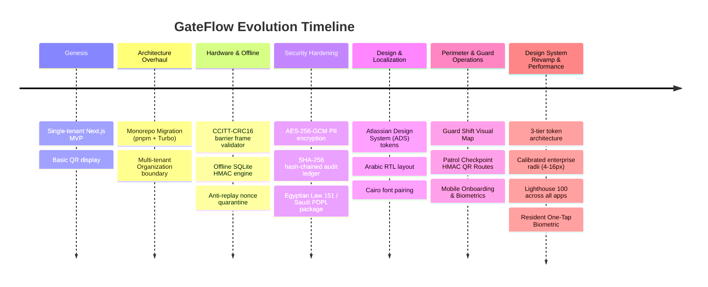

# GateFlow — Master Knowledge Base & Complete Context Reference (Day 1 to Present)

> **Universal Source Document for External AI Engines**: Grok, Google NotebookLM, Claude 3.5/Opus, ChatGPT-4o/o1, Gemini 1.5 Pro  
> **Repository**: `iDorgham/Gateflow` (Gate-Access Monorepo)  
> **Workspace Version**: `0.5.1`  
> **PRD Version**: `v13.0`  
> **Production Target**: `https://*.gateflow.site`  
> **Last Comprehensive Audit**: August 31, 2026

---

## 1. Executive Summary & Problem Domain

**GateFlow** is an enterprise-grade physical security automation and gated-community operations SaaS platform engineered specifically for the MENA region (Egypt, Saudi Arabia, UAE, Qatar) and global smart facilities.

### Core Problems Solved

1. **Manual Guard Logbook Inefficiencies**: Replaced with optical QR code scans (<120ms verification latency) and automated barrier triggers.
2. **Internet Dependency in Security Gates**: Offline-first verification engine allows guards and gate barriers to validate HMAC-SHA256 QR passes and prevent replay attacks even when disconnected from the cloud.
3. **Data Privacy & MENA Compliance**: End-to-end alignment with Egyptian Personal Data Protection Law (Law 151 of 2020) and Saudi PDPL regulations, featuring AES-256-GCM field encryption for PII and tamper-evident SHA-256 chained audit logs.
4. **Bilingual Arabic/English Experience**: Native right-to-left (RTL) layout with Cairo Arabic typography and unified cross-subdomain `.gateflow.site` language/theme persistence.
5. **Perimeter Situational Awareness & Guard Operations**: Real-time guard shift visual map, live gate occupancy, cryptographic HMAC patrol route verification, and resident one-tap biometric access.

---

## 2. Full History & Monorepo Evolution (Day 1 to Present)



- **Phase 1 (Genesis)**: Single-tenant Next.js prototype with simple QR generation for residential gate access.
- **Phase 2 (Monorepo & Multi-Tenancy)**: Transitioned to a pnpm + Turborepo monorepo separating `marketing`, `client-dashboard`, `admin-dashboard`, `resident-portal`, `design-system`, `scanner-app`, and `resident-mobile`. Introduced `Organization` root multi-tenancy.
- **Phase 3 (Cryptographic Access & Hardware Relays)**: Implemented cryptographic HMAC-SHA256 QR signing with deterministic `qrId` binding, anti-replay nonce windows, and CCITT-CRC16 framed TCP/serial barrier relay controllers.
- **Phase 4 (Enterprise Compliance & Security)**: Integrated AES-256-GCM envelope encryption for sensitive fields, SHA-256 tamper-evident chained audit trails, and step-up MFA challenge modals for privileged mutations.
- **Phase 5 (ADS Design System & MENA Regionalization)**: Standardized on Atlassian Design System (ADS) token semantics (`@gateflow/theme`), bidirectional Arabic RTL layouts, and Egyptian Arabic copywriting.
- **Phase 6 (Perimeter Operations & Guard Telemetry)**:
  - **Guard Shift Visual Map**: Live gate terminal occupancy, active shift counters, and handover controls.
  - **Patrol Checkpoints**: Perimeter routes, HMAC QR checkpoints, map telemetry, and supervisor reporting.
  - **Scanner App Onboarding**: 4-step wizard, fail-closed SecureStore PIN vault, 5-min inactivity lock, and 72x72px Master Scan FAB.
- **Phase 7 (Design System Revamp & Lighthouse 100)**:
  - **Design System Impeccable Revamp**: 3-tier token architecture (foundations, semantic, component), OKLCH Satin-Charcoal Dark Mode (`--ds-layer-01` to `--ds-layer-04`), switchable Cobalt/Emerald accents, 19/19 WCAG 2.2 AA contrast, calibrated enterprise radii scale (`4px`–`16px`), and Vibe-Check AI sandbox.
  - **Lighthouse 100 & Zero-CLS**: 5-phase performance overhaul across all applications, zero-CLS `DynamicIsland` primitives, font preloading, and `.lighthouserc.js` CI hard-gates.
  - **Resident Mobile One-Tap**: $\le 800\text{ms}$ biometric unlock, fail-closed PIN fallback, vector HMAC QR, 3-tap visitor pass sharing, interactive arrival alerts ($\le 3\text{s}$).

---

## 3. Monorepo Topology & Codebase Structure

```
Gate-Access/
├── apps/
│   ├── marketing/           # Public portal, SEO, pricing, lead generation (Next.js 14 App Router, Port 3000)
│   ├── client-dashboard/    # Facility operations, QR studio, GateAI concierge, CRM (Next.js 14, Port 3001)
│   ├── admin-dashboard/     # SuperAdmin tenant governance, billing, telemetry (Next.js 14, Port 3002)
│   ├── resident-portal/     # Resident PWA for visitor pass creation & entry tracking (Next.js 14, Port 3003)
│   ├── design-system/       # Interactive ADS component showcase & token catalog (Next.js 14, Port 3004)
│   ├── scanner-app/         # Security guard native barrier controller (Expo SDK 54, React Native)
│   └── resident-mobile/     # Resident native smartphone key & biometrics (Expo SDK 54, React Native)
│
├── packages/
│   ├── db/                  # Prisma schema (63 models), PostgreSQL migrations, singleton client
│   ├── theme/               # @gateflow/theme: ADS tokens, next-themes, synchronous cookie sync
│   ├── i18n/                # @gate-access/i18n: Shared Arabic/English locale cookie helpers
│   ├── ui/                  # @gate-access/ui: Shared component primitives & native token exports
│   ├── security/            # @gate-access/security: AES-256-GCM, HMAC-SHA256, Audit ledger
│   ├── config/              # Shared ESLint, Prettier, TypeScript, and Tailwind configurations
│   └── types/               # Shared domain interfaces and API payload types
│
├── docs/                    # Architecture, PRDs, audits, planning backlog, references
├── scripts/                 # AI synchronization, preflight checks, CI automation, db migrate
└── .github/workflows/       # Automated CI/CD (deploy.yml, ci.yml, security-scan.yml)
```

---

## 4. Comprehensive Database Schema & Entity Dictionary

GateFlow's database tier runs on **PostgreSQL** managed by **Prisma 6.x** with 67 models and 41 enums:

### Core Entity Relationships

| Model                       | Multi-Tenancy Scope (`organizationId`) | Soft Delete (`deletedAt`) | Description                                                                                                                  |
| :-------------------------- | :------------------------------------- | :------------------------ | :--------------------------------------------------------------------------------------------------------------------------- |
| **`Organization`**          | Tenant Root                            | ✓                         | Top-level tenant boundary. Holds billing tier (`FREE`, `STARTER`, `PRO`, `ENTERPRISE`), domain slugs, and security settings. |
| **`Project`**               | ✓                                      | ✓                         | Physical gated community, residential compound, or enterprise facility.                                                      |
| **`User`**                  | ✓                                      | ✓                         | Dashboard operator or staff member with role (`SUPERADMIN`, `ORG_OWNER`, `ORG_ADMIN`, `GUARD`, `CONCIERGE`).                 |
| **`Resident`**              | ✓                                      | ✓                         | Occupant profile associated with one or more `Unit` records; authorized to generate visitor passes.                          |
| **`Unit`**                  | ✓                                      | ✓                         | Physical apartment, villa, or office suite within a `Project`.                                                               |
| **`VisitorPass`**           | ✓                                      | ✓                         | Time-bounded guest invitation with guest name, phone, plate number, and HMAC-SHA256 signature.                               |
| **`QRCode`**                | ✓                                      | ✓                         | Cryptographic QR code record with hashed payload, nonces, and scan limits.                                                   |
| **`Gate`**                  | ✓                                      | ✓                         | Physical entrance/exit barrier lane linked to hardware relay controller and IP/serial scanner.                               |
| **`GateAssignment`**        | ✓                                      | ✓                         | Active mapping between security guards, shifts, and assigned physical gates.                                                 |
| **`ShiftLog`**              | ✓                                      | —                         | Guard shift start/end timestamps, assigned terminal, and summary scan counters.                                              |
| **`PatrolRoute`**           | ✓                                      | ✓                         | Defined guard patrol loop with ordered sequence of physical checkpoints and expected schedule.                               |
| **`PatrolCheckpoint`**      | ✓                                      | ✓                         | Physical checkpoint beacon/sign with cryptographic HMAC-signed QR token and GPS coordinates.                                 |
| **`PatrolLog`**             | ✓                                      | —                         | Recorded guard patrol session with compliance status (`ON_TIME`, `DELAYED`, `INCOMPLETE`).                                   |
| **`CheckpointScan`**        | ✓                                      | —                         | Individual checkpoint scan verification event with timestamp and guard proof.                                                |
| **`ScanLog`**               | —                                      | —                         | High-throughput access log storing scan timestamps, gate IDs, outcomes (`GRANTED`, `DENIED_*`), and guard IDs.               |
| **`AuditLog`**              | ✓                                      | —                         | Cryptographically chained audit record (`prevHash` linking) tracking all administrative mutations.                           |
| **`WorkOrder`**             | ✓                                      | ✓                         | Maintenance tickets automatically delegated by GateAI concierge or manually by facility admins.                              |
| **`ApiKey`**                | ✓                                      | —                         | Programmatic integration API keys with granular permission scopes and SHA-256 secret hashing.                                |
| **`AdminAuthorizationKey`** | ✓                                      | —                         | One-time elevation keys for high-privilege SuperAdmin maintenance operations.                                                |
| **`Webhook`**               | ✓                                      | ✓                         | Event subscription endpoints with HMAC-SHA256 signature delivery validation.                                                 |
| **`AiTask`**                | ✓                                      | —                         | Background autonomous AI job queue (incident triage, automated shift reports).                                               |
| **`Lead` / `Deal`**         | ✓                                      | ✓                         | Built-in CRM pipeline for enterprise sales and property management vendor onboarding.                                        |

---

## 5. Complete API Route Map (187+ Endpoints)

### 5.1. `client-dashboard` API Endpoints (`apps/client-dashboard`)

- **Auth & Session**: `/api/auth/[...nextauth]`, `/api/auth/mfa/challenge`, `/api/auth/mfa/verify`, `/api/users/me/preferences`.
- **Visitor & QR Studio**: `/api/qrcodes`, `/api/qrcodes/[id]`, `/api/qrcodes/export`, `/api/visitor-pass/generate`, `/api/visitor-pass/revoke`.
- **Gate Operations & Scanner**: `/api/scanner/verify`, `/api/scanner/shift/active`, `/api/gates`, `/api/gates/[id]/relay-trigger`, `/api/projects/[id]/logs`.
- **Real-time Streaming**: `/api/realtime/events` (Server-Sent Events streaming live visitor arrivals and perimeter alerts).
- **GateAI Concierge**: `/api/ai/chat`, `/api/ai/actions/[id]/feedback`, `/api/cron/ai-tasks`, `/api/ai/maintenance-executor`.
- **Resident & Units**: `/api/residents`, `/api/residents/[id]`, `/api/units`, `/api/contacts`.
- **Compliance & Security**: `/api/compliance/export-data` (Law 151 / PDPL), `/api/compliance/erasure-request`, `/api/audit-logs`.

### 5.2. `admin-dashboard` API Endpoints (`apps/admin-dashboard`)

- **Tenant Governance**: `/api/admin/organizations`, `/api/admin/organizations/[id]`, `/api/admin/reset-tenant`, `/api/admin/seed-hierarchy`.
- **SuperAdmin Auth**: `/api/admin/login`, `/api/admin/authorization-keys`, `/api/admin/authorization-keys/[id]`.
- **Global Telemetry**: `/api/admin/analytics`, `/api/admin/health`, `/api/admin/finance`, `/api/admin/emulate-traffic`.
- **Global Audit Logs**: `/api/admin/audit-logs/export`.

### 5.3. `resident-portal` API Endpoints (`apps/resident-portal`)

- **Pass Management**: `/api/resident/invite`, `/api/resident/passes`, `/api/resident/passes/[id]/revoke`.
- **Arrival Tracking**: `/api/resident/arrived`, `/api/resident/history`.
- **Push Notifications**: `/api/resident/push-token`, `/api/resident/push/send`.

### 5.4. `marketing` API Endpoints (`apps/marketing`)

- **Lead Capture**: `/api/contact`, `/api/demo-request`, `/api/marketing/utm-track`.
- **Newsletter & Blog**: `/api/newsletter/subscribe`, `/api/blog/posts`.

---

## 6. Cryptography & Hardware Relay Protocols

### 6.1. HMAC-SHA256 QR Code Lifecycle

1. **Payload Generation**:
   ```json
   {
     "qrId": "qr_01HX9J...",
     "orgId": "org_eg_cairo_01",
     "projId": "proj_palm_hills_02",
     "exp": 1787800000,
     "nonce": "8f3b2a1c9d4e",
     "sig": "3a7b9c1d...<hmac_sha256_hash>"
   }
   ```
2. **Signature Verification**:
   $$\text{Signature} = \text{HMAC-SHA256}(\text{qrId} + \text{orgId} + \text{projId} + \text{exp} + \text{nonce}, \text{SecretKey})$$
3. **Sliding Anti-Replay Nonce Quarantine**:
   - The scanner checks its local SQLite cache for previously scanned nonces. If a nonce exists within its validity window, access is immediately **DENIED_NONCE_REPLAY**.
4. **Relay Frame Protocol (CCITT-CRC16)**:
   - To trigger barrier opening, the scanner sends a binary frame over TCP/RS-485 to the relay controller:
     $$\text{Packet} = [\text{0xAA}, \text{0x55}, \text{Cmd: 0x01 (Open)}, \text{GateId: 2B}, \text{Duration: 2B}, \text{CRC16: 2B}, \text{0xEE}]$$

### 6.2. PII Field Encryption (AES-256-GCM)

- National ID numbers, phone numbers, and vehicle license plates are encrypted at rest using AES-256-GCM with per-organization cryptographic salt and envelope keys.

### 6.3. Tamper-Evident SHA-256 Audit Chaining

- Every `AuditLog` entry computes its cryptographic hash from the payload and the `prevHash` of the preceding record, forming an immutable cryptographic ledger.

---

## 7. Design System (ADS), Theming & Localization

### 7.1. Atlassian Design System Tokens & Impeccable Revamp (`@gateflow/theme`)

- **3-Tier Token Architecture**: Foundations, Semantic Layer (`ds` namespace), and Component-Level Tokens.
- **OKLCH Satin-Charcoal Dark Mode**: Multi-layered background elevation (`--ds-layer-01` to `--ds-layer-04`) with Porcelain Light Mode and procedural rim-light edge-glow shaders.
- **Switchable Accent Profiles**: Kimchi (default brand), Cobalt, and Emerald with 19/19 WCAG 2.2 AA contrast compliance.
- **Calibrated Enterprise Radii Scale**: Crisp enterprise radii (`4px` to `16px`) eliminating bubbly borders.
- **Enhanced Primitives**: FormField (controller & standalone ARIA linkage), Badge (5 variants, 7 tones), Card (interactive/selectable/metric), Button (FAB variant, spinner), and DynamicTable mobile card transform.
- **AI Design Tools**: Machine-readable `DESIGN.md`, `llms.txt`, prompt writing guide, and Vibe-Check AI code sanitizer sandbox.

### 7.2. Cross-App Locale Synchronization (`@gate-access/i18n`)

- Shared locale cookie `gf_locale` configured with `Domain=.gateflow.site` in production.
- Selecting Arabic in `marketing` (`www.gateflow.site`) automatically carries over to `client-dashboard` (`app.gateflow.site`) and `resident-portal` (`portal.gateflow.site`).
- Bidirectional layout support with Google Cairo font for Arabic and Inter font for English, utilizing logical CSS spacing (`ms-*`, `me-*`, `ps-*`, `pe-*`).

---

## 8. Golden Rules & Invariants for External AI Engines

When generating code, analyzing bugs, or designing architecture for GateFlow, **ALWAYS** follow these non-negotiable rules:

1. **Strict Multi-Tenancy**:
   - Every single database query on tenant models MUST filter by `organizationId: session.organizationId`.
   - Never write unscoped queries on tenant data.
2. **Soft Delete Handling**:
   - Only apply `deletedAt: null` to Prisma models that explicitly define the `deletedAt` field (`User`, `Resident`, `VisitorPass`, `Unit`, `Contact`, `Project`, etc.).
   - Never add `deletedAt` filters to log models (`ScanLog`, `AuditLog`, `ShiftLog`, `EventLog`).
3. **Database URL Separation**:
   - Runtime app code connects via pooled `DATABASE_URL` (Accelerate / PgBouncer).
   - Prisma CLI migrations and direct schema commands MUST use `DIRECT_DATABASE_URL`.
4. **PWA & Service Worker Safety**:
   - Service workers must prioritize network-first navigation with graceful fallbacks. Never return `undefined` from `event.respondWith()`.
5. **Deterministic QR Verification**:
   - The dashboard QR generator must persist the database ID into the signed HMAC payload's `qrId` field and encode it into the QR image.
6. **Package Management**:
   - Always use `pnpm`. Never invoke `npm` or `yarn`.

---

## 9. Key CLI Commands & Verification Suite

- **Full Monorepo Preflight**: `pnpm preflight` (Runs changelog check, ADS lint, bootstrap route check, turbo lint, turbo typecheck, and turbo test across all 19 workspace packages).
- **Targeted App Tests**: `pnpm --filter <app-name> test` (e.g., `pnpm --filter client-dashboard test`).
- **Database Migration**: `pnpm --filter @gate-access/db prisma migrate dev`.
- **Production Deployment**: `gh workflow run deploy.yml --ref master -f app=all` (Manual dispatch only; push-to-deploy is disabled by design).
